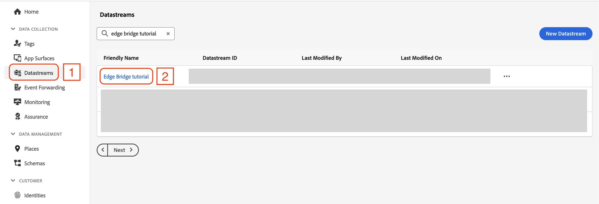
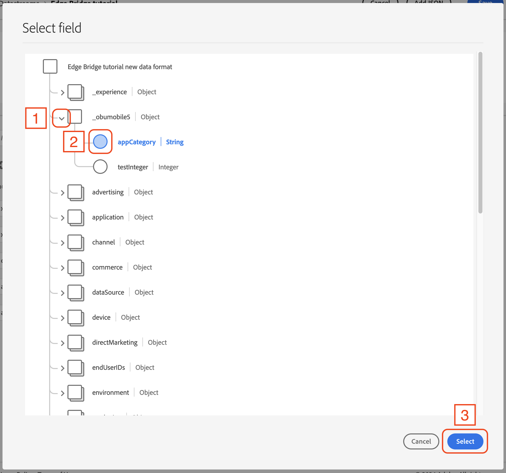
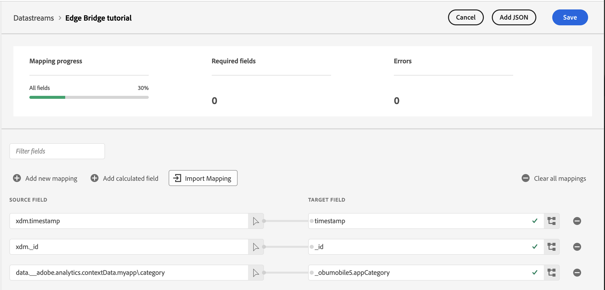
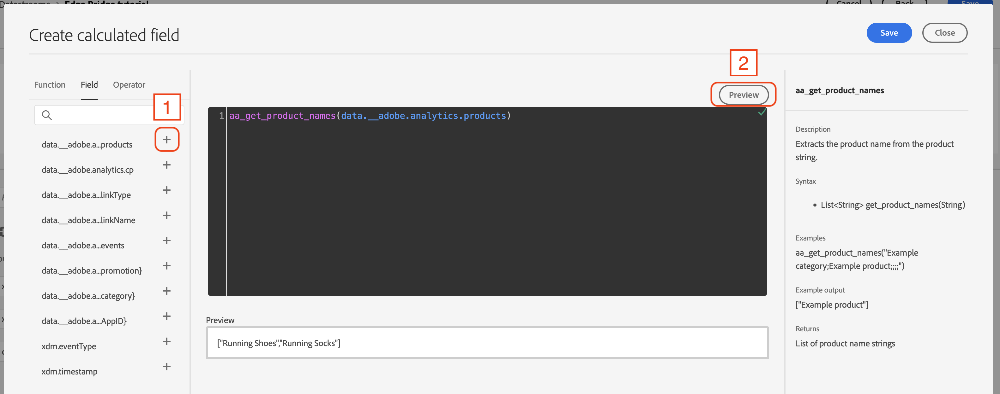
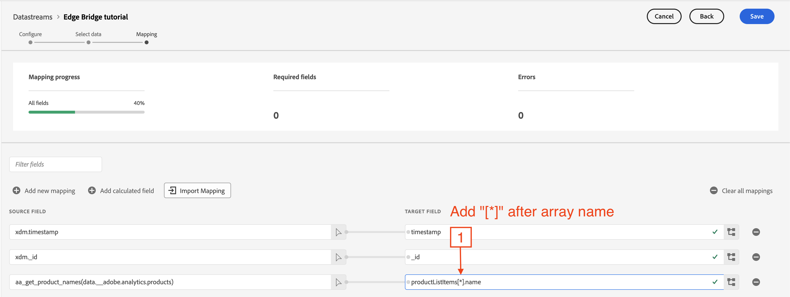
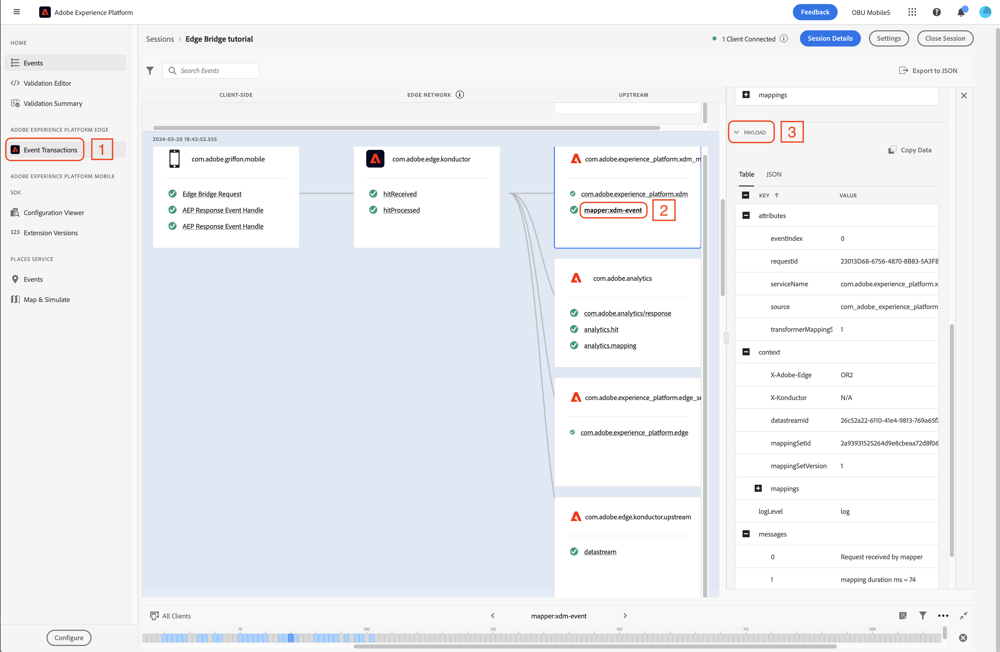

# Map track event data with Data Prep for Data Collection <!-- omit in toc -->

## Table of Contents <!-- omit in toc -->
- [Overview](#overview)
  - [Environment](#environment)
  - [Prerequisites](#prerequisites)
- [Data Prep for Data Collection mapping](#data-prep-for-data-collection-mapping)
  - [Mapping custom `contextData` keys](#mapping-custom-contextdata-keys)
  - [Mapping calculated fields using Analytics functions](#mapping-calculated-fields-using-analytics-functions)
- [Validating Data Prep mapping using Assurance](#validating-data-prep-mapping-using-assurance)

## Overview
This tutorial covers how to use Data Prep for Data Collection to enable using Edge Bridge event data in other Experience Platform applications, by mapping event data to the [Experience Data Model (XDM)](https://experienceleague.adobe.com/docs/experience-platform/xdm/home.html) specification.


### Environment
- macOS machine with a recent version of Xcode installed.

### Prerequisites
1. Completing the tutorial: [Migrating from Analytics mobile extension to the Edge Network using the Edge Bridge extension](edge-bridge-tutorial.md)

## Data Prep for Data Collection mapping
Edge Bridge transforms track events into an Edge Network event format suitable for Adobe Analytics, so that mapping data to XDM is not required for Analytics. However, to use this same event data in other Experience Platform applications, it must first be mapped to the XDM specification using [Data Prep for Data Collection](https://experienceleague.adobe.com/en/docs/experience-platform/datastreams/data-prep).

This section covers how to map event data sent from Edge Bridge in the Data Collection UI.

To open the Data Prep mapper:
1. Log in to the [Adobe Experience Platfom](https://experience.adobe.com/#/platform).
2. In the left-side navigation panel under **DATA COLLECTION**, select **Datastreams** (**1**).
3. Select your datastream (**2**).

  

4. In the right-side navigation panel, select **Edit Mapping** (**1**).  


> [!IMPORTANT]
> Data Prep allows only one consolidated mapping configuration per datastream, meaning all potential event payloads sent through a specific datastream must be merged for simultaneous mapping. Note that Data Prep requires `data` and `xdm` to be top-level objects in the source JSON.

We will cover two mapping use cases:
1. Custom `contextData` keys.
2. Using Data Prep Analytics functions to map Analytics-formatted strings, such as `products` and `events`.

The properties from `trackAction` and `trackState` events in the tutorial app must be combined into a single JSON. For simplicity, the merged data structure is provided below:

```json
{
  "data": {
    "__adobe": {
      "analytics": {
        "products": ";Running Shoes;1;69.95;event1|event2=55.99;eVar1=12345,;Running Socks;10;29.99;event2=10.95;eVar1=54321",
        "cp": "foreground",
        "linkType": "other",
        "linkName": "purchase",
        "events": "event5,purchase",
        "contextData": {
          "myapp.promotion": "a0138",
          "myapp.category": "189025",
          "a.AppID": "EdgeBridgeTutorialApp 1.0 (1)"
        }
      }
    }
  },
  "xdm": {
    "eventType": "analytics.track",
    "timestamp": "2024-03-21T00:56:44.052Z"
  }
}
```

<details>
  <summary> Getting the JSON data from Assurance </summary><p>
  
1. Navigate back to your Assurance session for the Edge Bridge app and select the **Edge Bridge Request** event (**1**).
2. Open the **RAW EVENT** dropdown, then click and drag to highlight the **ACPExtensionEventData** value as shown, and copy the selected value.

  

> [!TIP]
> To merge event data, look for properties under the `data.__adobe.analytics` hierarchy that are unique among the different types of events sent from your app, and include them in the final data payload.

</p></details>

1. Copy and paste the JSON data into the input box under **Define Incoming Data** (**1**).
2. Check that the uploaded JSON matches what is displayed in the `Preview Sample Data` section (**2**) and select `Next` (**3**).

  

> [!NOTE]
> XDM source fields automatically map to the target schema when the same field exists in both. For example, `xdm._id` and `xdm.timestamp` are required fields in a time-series XDM schema, thus they automatically map from source data to the target schema without needing a manual mapping entry.

> [!TIP]
> Edge Bridge automatically assigns an `xdm.eventType` value of `analytics.track`. However, you can override this value by adding a new mapping row in Data Prep and setting the **Target Field** to `eventType`.

### Mapping custom `contextData` keys

1. Select the **Add new mapping** button (**1**).

  

2. A new entry for mapping will appear in the window; select the arrow button (**1**) to the right of the **Select source field** input box.

  

3. In the JSON property selector window, select the dropdown chevrons next to **data** -> **__adobe** -> **analytics** -> **contextData** (**1**).
4. Then choose the property to map, **myapp.category** (**2**), and select **Select** (**3**).

  

> [!IMPORTANT]
> When interacting with hierarchies, if a child attribute contains a period (`.`), use a backslash (`\`) to escape special characters. For more details, refer to the guide on [escaping special characters](https://experienceleague.adobe.com/en/docs/experience-platform/data-prep/home#escape-special-characters).

5. Add a backslash `\` before the `.` character in `myapp.category` as shown below (**1**).
    - Example: `myapp.category` -> `myapp\.category`

Now that the source field setup is complete, the next step is to map this property to its corresponding target property in the XDM schema.

6. Select the schema icon (**2**) to open the XDM property viewer window.

  

> [!NOTE]
> The next steps rely on a custom property defined in the XDM schema. See how to create one in the documentation [Define XDM fields in the UI](https://experienceleague.adobe.com/en/docs/experience-platform/xdm/ui/fields/overview).

1. In the XDM property viewer window, select the dropdown chevron next to **_obumobile5** (**1**) (this value will reflect your actual `_tenantId`).
2. Then choose the **appCategory** property (**2**) (a custom property) and select **Select** (**3**).

  

The final result is a mapping from the custom `contextData` key `myapp.context` to `_obumobile5.appCategory`.

  

After creating the desired mappings, select **Save** in the top right.

### Mapping calculated fields using Analytics functions

1. Select the **Add calculated field** button (**1**).

  

2. In the **Create Calculated Field** window, check that the **Function** tab (**1**) is selected, then narrow down to the Analytics functions by inputting `aa` into the search box (**2**).

  

3. Select the plus button next to **aa_get_product_names** (**1**) and notice that the function is populated in the main editor window.
4. Next, select the **Field** tab (**2**).

> [!TIP]
> Selecting the function name itself will display help text in the right-side help panel, which will give you more context on how to use the function.

  

5. Set the editor cursor between the parentheses of the `aa_get_product_names()` function in the editor area (**1**).

  

6. Select the plus button (**+**) next to **data.__adobe.analytics.products** (**1**)
   1. You may select **Preview** (**2**) to see what the output of the function will be.

  

7. Select the schema icon (**1**) to open the XDM property viewer window.

  

8. In the XDM property viewer window, select the dropdown chevron next to **productListItems** (**1**).
9. Then choose the **name** property (**2**) and select **Select** (**3**).

  

> [!TIP] 
> If you want to map an array of objects in the source field to an array of different objects in the target field, add `[*]` after the array name in the destination field paths.

  

After creating the desired mappings, select **Save** in the top right.

See the documentation on the [Analytics functions](https://experienceleague.adobe.com/en/docs/experience-platform/data-prep/functions#analytics) for the full list of Data Prep Analytics functions.

## Validating Data Prep mapping using Assurance
Now that the mapping is set up in the datastream, we have the full pathway of data:


By using the **Event Transactions** view (**1**) in the left-side navigation panel, you can follow the logical flow of events from the event dispatched by the `trackAction` API to data mapping.  
1. Select the Data Prep mapping event **mapper:xdm-event** (**2**) to see the event details in the right-side information panel.
2. Under the **PAYLOAD** section (**3**), you can explore the event payload data.

  

To see the data in JSON format, select the **JSON** tab (**1**). You can view the event data in JSON format below (**2**).
  

