# Migrating from Analytics mobile extension to Edge Network using the EdgeBridge extension

## Table of Contents
- [Migrating from Analytics mobile extension to Edge Network using the EdgeBridge extension](#migrating-from-analytics-mobile-extension-to-edge-network-using-the-edgebridge-extension)
  - [Table of Contents](#table-of-contents)
  - [Overview](#overview)
    - [Environment](#environment)
    - [Prerequisites](#prerequisites)
    - [Adobe Experience Platform setup](#adobe-experience-platform-setup)
    - [1. Create a schema](#1-create-a-schema)
    - [2. Create a datastream](#2-create-a-datastream)
  - [Client-side implementation](#client-side-implementation)
    - [1. Get a copy of the files (code and tutorial app)](#1-get-a-copy-of-the-files-code-and-tutorial-app)
    - [1. Install Edge Bridge using dependency manager (CocoaPods)](#1-install-edge-bridge-using-dependency-manager-cocoapods)
    - [2. Update Tutorial App Code to Enable EdgeBridge functionality](#2-update-tutorial-app-code-to-enable-edgebridge-functionality)
    - [3. Run app](#3-run-app)
    - [4. TrackAction/TrackState implementation examples](#4-trackactiontrackstate-implementation-examples)
  - [Initial validation with Assurance](#initial-validation-with-assurance)
    - [1. Set up the Assurance session](#1-set-up-the-assurance-session)
    - [2. Connect to the app](#2-connect-to-the-app)
    - [3. Event transactions view - check for Edge Bridge events](#3-event-transactions-view---check-for-edge-bridge-events)
  - [Data prep mapping](#data-prep-mapping)
  - [Validation with Assurance](#validation-with-assurance)

## Overview
This hands-on tutorial provides end-to-end instructions on how to migrate to Edge Network from Analytics to EdgeBridge mobile extension.

There are other beginning states the customer can be in like using ACP Analytics, v4 extension, etc. These usages can potentially be migrated to AEP and from there, this tutorial can be applied afterwards. However, this should be determined on a case-by-case basis, as for example in the v4 extension case, it may be more effective to simply implement AEP extensions itself without the need for Edge Bridge migration path.

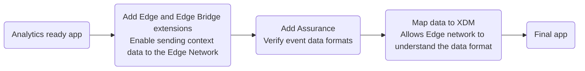
```mermaid
graph LR;
    step1(Analytics ready app) --> step2(Add Edge and Edge Bridge extensions<br/>Enable sending context data to the Edge Network) --> step3(Add Assurance<br/>Verify event data formats) --> step4(Map data to XDM<br/>Allows Edge network to understand the data format) --> step5(Final app);
```

### Environment
- macOS machine with a recent version of Xcode installed
- Cocoapods installed
- git with GitHub desktop or GitHub access token for access to repo
- Chrome/Chromium browser strongly recommended as some functionality doesn't work with Firefox (ex: Analytics info auto-populating in mobile property Extension, Analytics in general, etc.)

<!-- // TODO: remove outline after finishing tutorial
///////// OUTLINE
Tutorial setup:

Initial test app that is based on prerequisites (implements Analytics)
Final test app after all the tutorial steps have been implemented (implements EdgeBridge)

Tutorial steps:

      1. Prerequisites (set up Analytics report suite, mobile property, Assurance). List out required permissions for this tutorial: Analytics, Schema creation, Data Collection (Launch tags), Datastream view and edit, Assurance.

Install Edge Network & Edge Identity in Launch - Edge Bridge does not have a card here  
Analytics should remain installed in Launch for production app versions.  
Publish the changes  
////////// END: OUTLINE -->

### Prerequisites
- A timestamp enabled report suite is configured for mobile data collection.
- A tag (also known as mobile property) is configured in Data Collection UI which has Adobe Analytics extension installed and configured.

### Adobe Experience Platform setup
Before any app changes we need to set up some configuration items on the Adobe Experience Platform (AEP) side. The end goal of this section is to create a mobile property that controls the configuration settings for the various AEP extensions in use in this tutorial.

First we need to create an XDM schema (the format for data that the Edge Network uses) and configure a datastream (controls where the data will go). 

### 1. Create a schema  
At a high level, a schema is a definition for the structure of your data; what properties you are expecting, what format they should be in, and checks for the actual values coming in.  

1. Go to the [Adobe Experience Platform](https://experience.adobe.com/#/platform), using your Adobe ID credentials to log in if prompted.

2. Navigate to the Data Collection UI by clicking the nine-dot menu in the top right (**1**), and selecting `Data Collection` (**2**)  
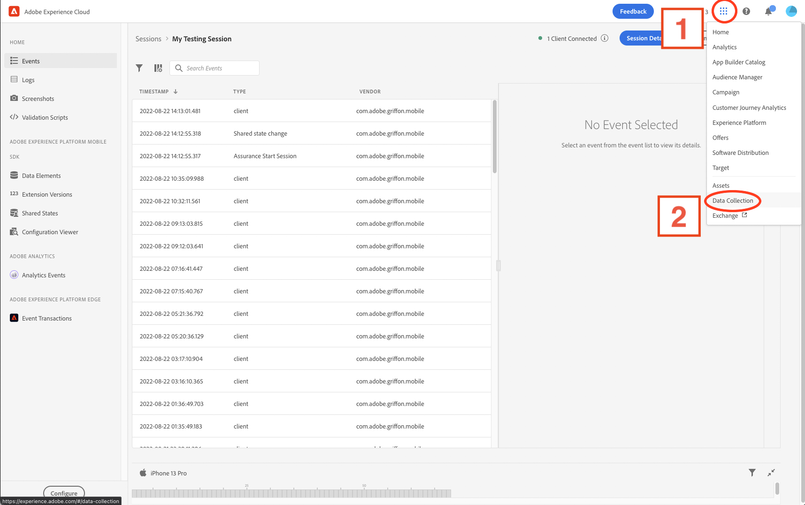

3. Click `Schemas` in the left navigation window  
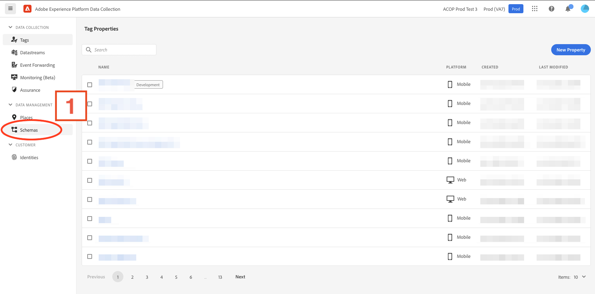

4. In the schemas view, click the `+ Create schema` button in the top right (**1**), then select `XDM ExperienceEvent` (**2**)
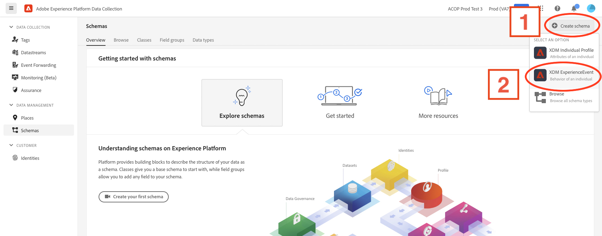

Once in the new schema creation view, notice the schema class is `XDM ExperienceEvent` (**1**); schemas adhere to specific class types which just means that they have some predefined properties and behaviors within the Edge platform. In this case, `XDM ExperienceEvent` creates the base properties you see in the `Structure` section that help define some baseline data for each Experience Event. 

5. Give the new schema a name and description (**2**) to help identify it.
6. Click the `+ Add` button (**3**) next to the `Field groups` section under `Composition`.

<details>
  <summary> What is a field group?</summary><p>

A schema is made up of building blocks called field groups.

Think of field groups as blueprints for specific groups of data; the data properties describing things like: the current device in use, products and contents/state of carts, information about the users themselves, etc. 

For example, the `Commerce Details` field group has properties for common commerce-related data like: 
- Product information (SKU, name, quantity)
- Cart state (abandons, product add sources, etc.). 
 
This logical grouping helps organize individual data properties into easily understandable sections. They are even reusable! Once you define a field group, you can use it in any schema that has a compatible class (some field groups only make sense with the capabilities of certain schema classes). There are two types of field groups available:

1. Adobe defined - standardized templates of common use-cases and datasets created and updated by Adobe
    - Note that Adobe Experience Platform services implicitly understand standard field groups and can provide additional functionality on top of just reading and writing data. That's why it is strongly recommended that you use standard field groups wherever possible.
2. Custom defined - any field group outside of the Adobe defined ones that users can use to create their own custom collections of data properties  

See the [Field Groups section in the Basics of schema composition](https://experienceleague.adobe.com/docs/experience-platform/xdm/schema/composition.html?lang=en#field-group) for an in depth look at how field groups work in the context of XDM schemas.

</p></details>

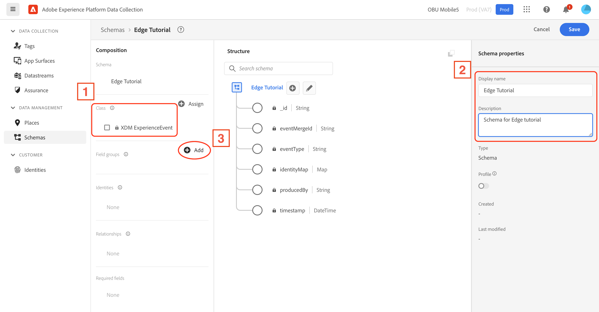

In our case, we're going to add three Adobe defined field groups to our schema:  
- AEP Mobile Lifecycle Details
- Adobe Experience Edge Autofilled Environment Details
- Commerce Details

You can use the search box (**1**) to look up the names (**2**) of the three field groups required for this exercise. Note the owner of each of the schemas should be `Adobe` (**3**).


<details>
  <summary> Hints for using the <code>Add field groups</code> tool</summary><p>

(<code>1</code>) Selected field groups are shown on the right side of the window, where you can quickly see what field groups have been selected so far, and remove individual or all field groups from the current add session.  

(<code>2</code>) Popularity: shows how many organizations are using the field group across the Adobe Experience Platform; can potentially be a good place to start in terms of finding which field groups may be the most useful for your needs.

(<code>3</code>) The inspector icon lets you see the field group structure, and the info icon presents a card with the field group name, industry, and description.

(<code>4</code>) The Industry filter selections let you quickly narrow down field groups based on the selected industry; another useful tool to find relevant field groups for your use-case.

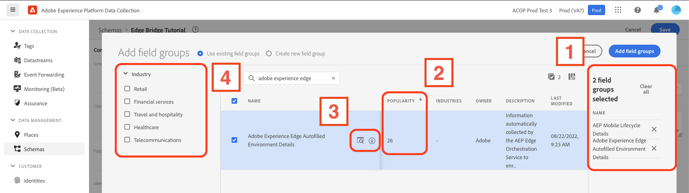  

</p></details>

Verify that all the required field groups are present in the right side info panel (**1**), then click `Add field groups` (**2**). 
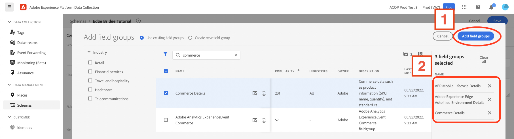  

Verify that the required field groups are present under the `Field groups` section (**1**) and the properties associated with those field groups are present under the `Structure` section (**2**), then click `Save` (**3**).
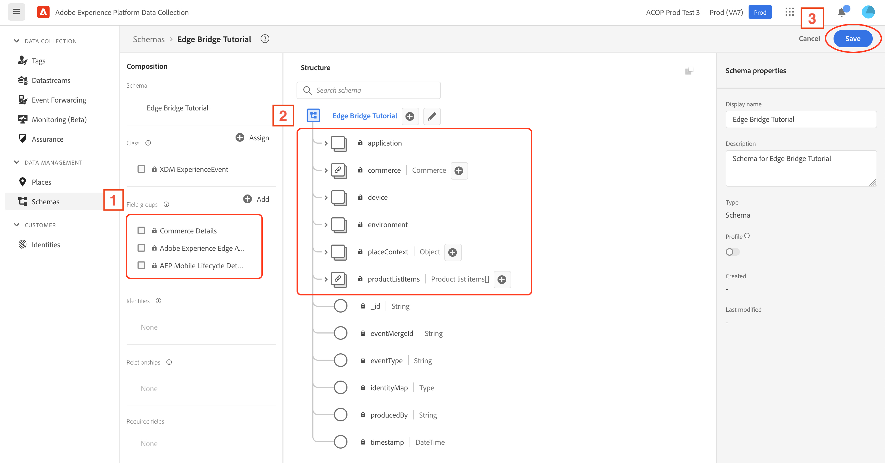  

<details>
  <summary> Hints for using the schema creator tool </summary><p>

To quickly see what properties are from a given field group, click the field group under the `Field groups` section (**1**). The properties are highlighted in the `Structure` section (**2**).

  

To see only the properties from a given field group, click the selection box next to the field group (**1**). The properties are filtered to only the selected field group in the `Structure` section (**2**).

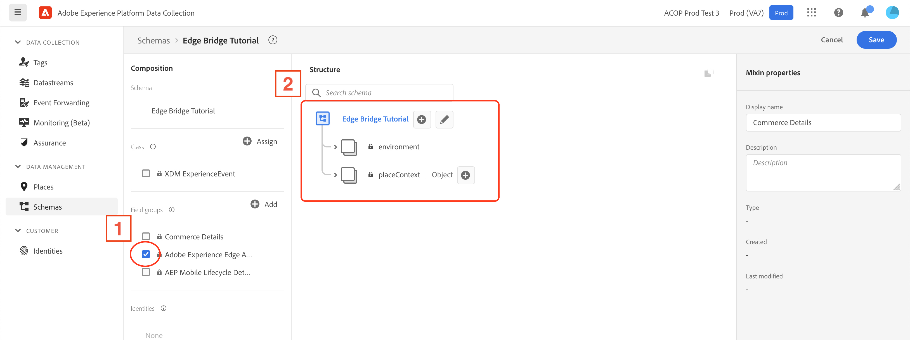  

</p></details>

### 2. Create a datastream

<details>
  <summary> What is a datastream? </summary><p>

A datastream is a server-side configuration on Platform Edge Network that controls where data goes. Datastreams ensure that incoming data is routed to Adobe Experience Cloud applications and services (like Analytics) appropriately. For more information, see the [datastreams documentation](https://experienceleague.adobe.com/docs/experience-platform/edge/datastreams/overview.html?lang=en) or this [video](https://experienceleague.adobe.com/docs/platform-learn/data-collection/edge-network/configure-datastreams.html?lang=en).

In order to send data to the Edge Network, the datastream must be configured with the Adobe Experience Platform service.

</p></details>

Click `Datastreams` under `DATA COLLECTION` in the left side navigation panel.

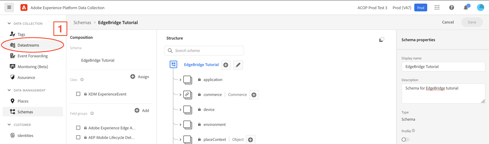  

Click `New Datastream` in the top right.

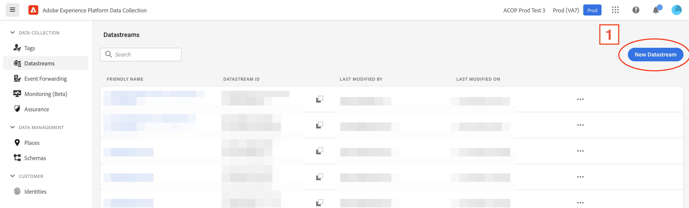  

Give the datastream an identifying name and description (**1**), then pick the schema created in the previous section using the dropdown menu (**2**). Then click `Save` (**3**). We will be returning to this datastream later on.

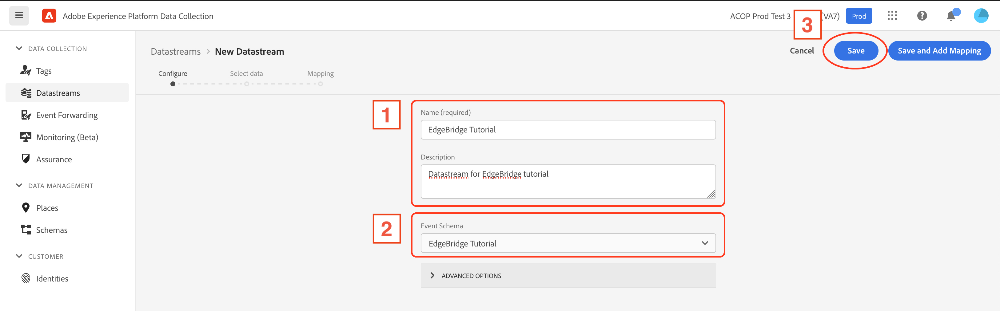  

// TODO: Mobile property setup?
Click `Tags` (**1**) under `DATA COLLECTION` in the left-side navigation panel.

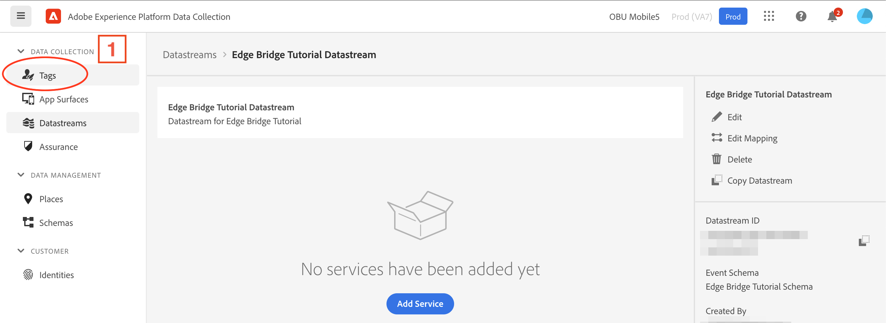  

Find and click the Edge Bridge tutorial mobile property (**2**), optionally using the search box to help quickly narrow down the search (**1**).

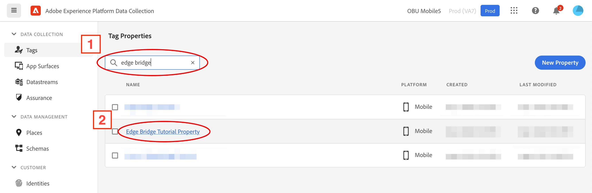  

Click `Extensions` (**1**) in the left-side navigation panel, under `AUTHORING`.

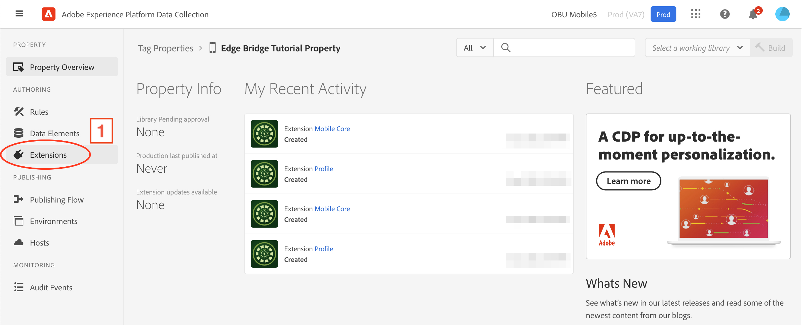  

Click `Catalog` (**1**) and (optionally) use the search box (**2**) to find the `Adobe Analytics` extension; click install (**3**) (if not done already). 

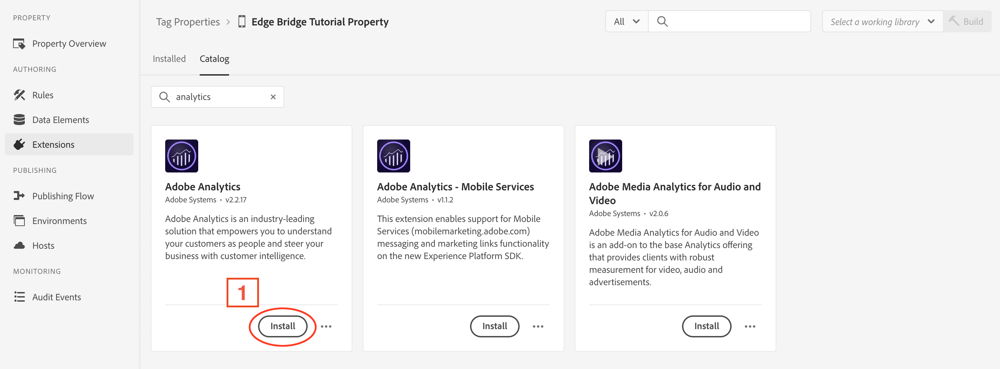  

<details>
  <summary> Adobe Analytics settings </summary><p>

  Click `Select or type a report suite [RSID]` (**1**) and select the Analytics report suite ID for this tutorial. Repeat this process for all three environments (**2**). Then click `Save` (**3**).

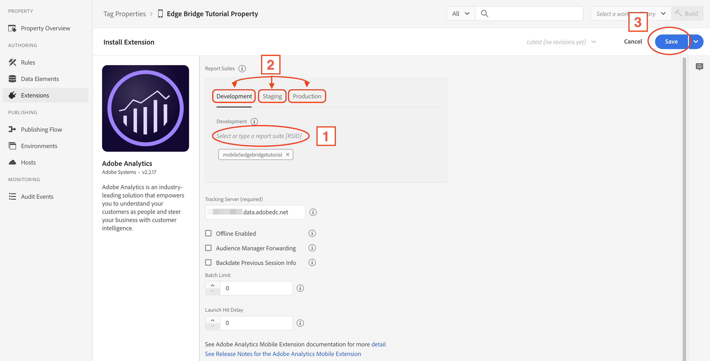  

</p></details>

We will also be installing the following AEP extension configurations:

<details>
  <summary> Adobe Experience Platform Edge Network </summary><p>

Go back to the `Catalog` and install the `Adobe Experience Platform Edge Network` extension configuration.

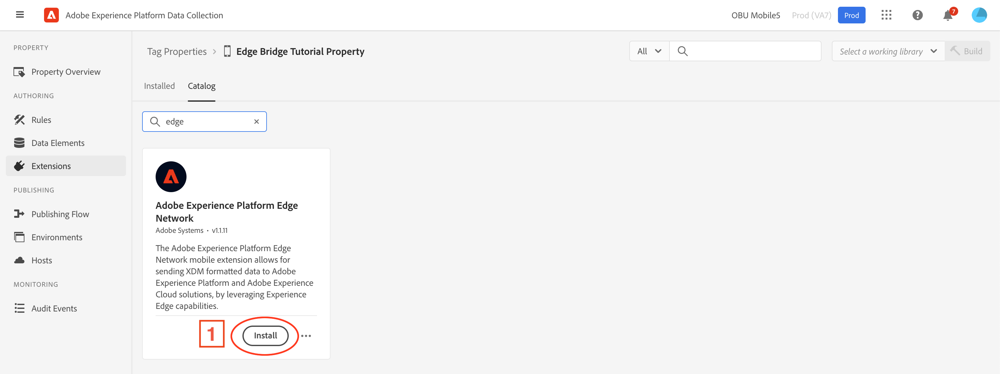  

In the extension configuration settings window, set the datastream for each environment (**1**) to the one created for this tutorial. Then click `Save` (**2**)

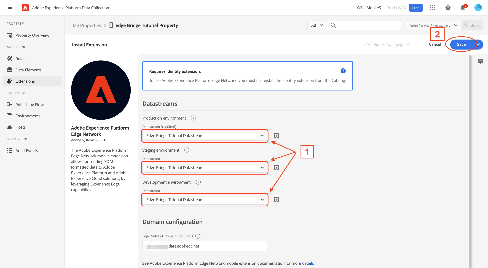  

</p></details>

<details>
  <summary> Identity </summary><p>

Open the `Catalog` and install the `Identity` extension configuration. There are no settings for this extension.

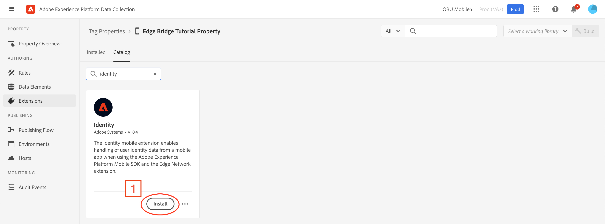  

</p></details>

<details>
  <summary> Consent </summary><p>

Open the `Catalog` and install the `Consent` extension configuration.

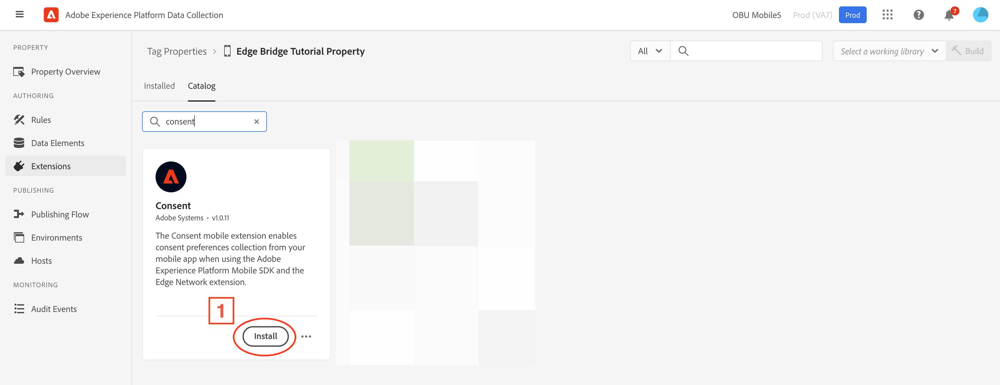  

In the extension configuration settings window, the `Default Consent Level` should be set to `Yes` by default (**1**); for the tutorial app this setting is fine as-is, however when using this configuration in production apps, it should reflect the requirements of the company's actual data collection policy for the app. 

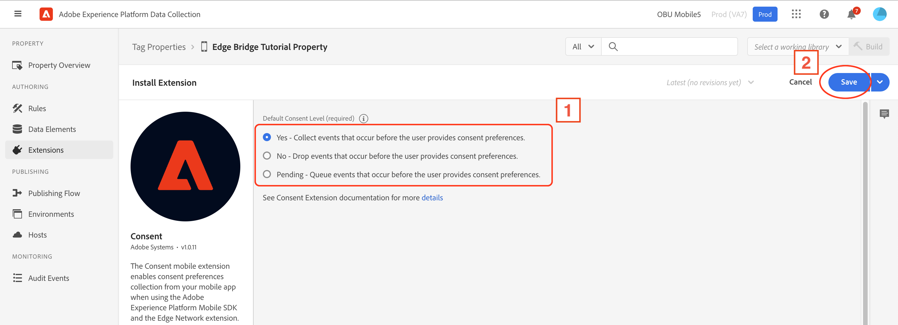  

</p></details>

You should see the following after all the extensions are installed: 

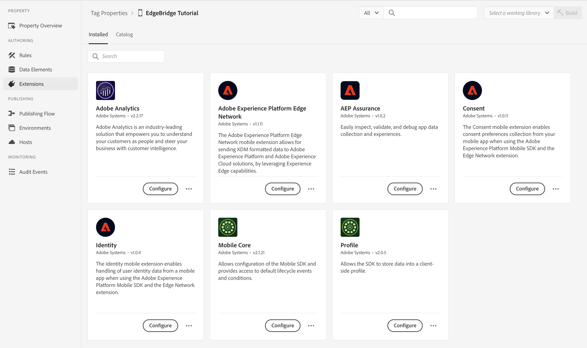  

// TODO: Publishing changes

## Client-side implementation
### 1. Get a copy of the files (code and tutorial app)
1. Download and install [GitHub Desktop](https://desktop.github.com/).
2. Open the app and login with your GitHub credentials and provide the required permissions.
3. Click `Clone a Repository from the Internet...`
4. In the window that opens, select `URL` in the top ribbon.
5. In the textfield with `URL or username/repository`, paste the following URL:
```
https://github.com/adobe/aepsdk-edgebridge-ios.git
```
Make a note of the value under `Local Path`; this is the folder path that GitHub Desktop is planning on creating the copy of the repository. By default it should be something like: `/Users/tim/Documents/GitHub` where instead of `tim` it would be your username.   

6. Click `Clone`

This will download a copy of the code from the official public Adobe code repository for the Edge Bridge extension onto your machine for you to work with! 

Now we can use the tutorial app to go through the changes required to install the Edge Bridge extension.

1. Open the `Finder` application.
2. Click `Documents` in the left-side navigation panel.
3. Open the `GitHub` directory.
4. You should see the `aepsdk-edgebridge-ios` directory, open it.

1. Open Xcode.
2. Click `Open a project or file`
3. Navigate to the repository: `Documents` -> `GitHub` -> `aepsdk-edgebridge-ios`
4. After selecting `aepsdk-edgebridge-ios` (the folder, not any of the inner files), click `Open`

1. Open the Terminal app
   - Applications -> Utilities -> Terminal
   - Open Spotlight search (CMD + Space) and search for "terminal"
2. Copy the following command, and paste into terminal
```bash
cd $HOME/Documents/Github/aepsdk-edgebridge-ios
```
Then press `return` to execute the command.

<details>
  <summary> What is <code>cd</code>? What did I just do? </summary><p>

`cd` is the terminal command for change directory; the command above changes your terminal's active directory to the repository we just copied.

`$HOME` is a terminal variable that stands for your base directory; by default ususally: `/Users/<your username>` for example, `/Users/tim`. When substituted, the full path becomes: `/Users/tim/Documents/Github/aepsdk-edgebridge-ios`, taking us to the newly cloned repository!

</p></details>

Now that we're in the project directory, there's some setup we have to do; the app depends on packages which are not installed with the repository. To install them, run the command:

```bash
pod update
```

<details>
  <summary> Using Swift package manager instead? </summary><p>

**Swift Package Manager**
This tutorial assumes a project using Cocoapods for package dependency management, but if following along with a project that uses Swift package manager, refer to the [README for instructions on how to add the EdgeBridge package](../../README.md#swift-package-managerhttpsgithubcomappleswift-package-manager).

</p></details>

You should see the dependency manager CocoaPods installing the various packages required by the project. 

<details>
  <summary> Expected output </summary><p>

```
tim@Tims-MacBook-Pro aepsdk-edgebridge-ios % pod update
Update all pods
Updating local specs repositories
Analyzing dependencies
Downloading dependencies
Installing AEPAssurance (3.0.1)
Installing AEPCore (3.7.1)
Installing AEPEdge (1.4.1)
Installing AEPEdgeIdentity (1.1.0)
Installing AEPLifecycle (3.7.1)
Installing AEPRulesEngine (1.2.0)
Installing AEPServices (3.7.1)
Installing SwiftLint (0.44.0)
Generating Pods project
Integrating client project
Pod installation complete! There are 6 dependencies from the Podfile and 8 total pods installed.
tim@Tims-MacBook-Pro aepsdk-edgebridge-ios % 
```

</p></details>

### 1. Install Edge Bridge using dependency manager (CocoaPods)
Our next task is actually modifying the file that controls the package dependencies, adding the new extensions that will enable the Edge Bridge extension to function.

Open the project using the command:
```bash
open AEPEdgeBridge.xcworkspace
```

This should automatically open the Xcode IDE. In Xcode:
1. Click the dropdown chevron next to `Pods` in the left-side navigation panel.
2. Click the `Podfile` file.
3. Replace the section: 

```ruby
target 'TutorialAppStart' do
  pod 'AEPAnalytics'
  pod 'AEPCore'
  pod 'AEPServices'
end
```
With:

```ruby
target 'TutorialAppStart' do
  pod 'AEPAnalytics'
  pod 'AEPAssurance'
  pod 'AEPCore'
  pod 'AEPEdge'
  pod 'AEPEdgeConsent'
  pod 'AEPEdgeIdentity'
  pod 'AEPLifecycle'
  pod 'AEPServices'
end
```

4. Go back to your terminal window and run:
```bash
pod update
```
Cocoapods will use this updated configuration file to install the new packages (including the EdgeBridge extension itself!), which will allow us to add new functionality in the app's code. 

### 2. Update Tutorial App Code to Enable EdgeBridge functionality
There are two files we need to update to enable the EdgeBridge extension. 
1. Click the dropdown chevron next to `AEPEdgeBridge` in the left-side navigation panel.
2. Click the dropdown chevron next to `TutorialAppStart`.
3. Click the `AppDelegate.swift` file.

Inside you will see code blocks for this tutorial that are greyed out, because they are commented out. They are marked by the header and footer `EdgeBridge Tutorial - code section n/m` (where `n` is the current section and `m` is the total number of sections in the file).

To uncomment the section and activate the code, simply add a forward slash at the front of the header:
```swift
/* EdgeBridge Tutorial - code section 1/2
```
To:
```swift
//* EdgeBridge Tutorial - code section 1/2
```
Make sure to uncomment all sections within the file (the total will tell you how many sections there are).

<details>
  <summary> What am I uncommenting in <code>AppDelegate.swift</code>? </summary><p>

Section 1: imports the EdgeBridge extension and other AEP extensions that enable its functionality and power other features. This makes it available to use in the code below.

Section 2: registers the extensions with Core (which contains all of the baseline capabilities required to run Adobe extensions), getting them ready to run in the app.

Section 3: Enables deep linking to connect to Assurance (which we will cover in depth in a later section); this is for iOS versions 12 and below.

</p></details>

Repeat this process for the `SceneDelegate.swift` file.

<details>
  <summary> What am I uncommenting in <code>SceneDelegate.swift</code>? </summary><p>

Section 1: imports the Assurance extension for use in the code below.

Section 2: Enables deep linking to connect to Assurance (which we will cover in depth in a later section); this is for iOS versions 13 and above.

</p></details>

### 3. Run app   
In Xcode, select the app target you want to run, and the destination device to run it on (either simulator or physical device). Then press the play button.

You should see your application running on the device you selected, with logs being displayed in the console in Xcode. 

> **Note**
> If the debug console area is not shown by default, activate it by selecting:  
> View -> Debug Area -> Show Debug Area

### 4. TrackAction/TrackState implementation examples   
With Edge Bridge extension successfully installed and registered, you can make the regular Analytics `trackAction` and `trackState` calls, which will be captured by Edge Bridge extension and sent to the Edge network.

Check `ContentView.swift` for implementation examples of both APIs. You can see the data payloads that are to be sent with the calls.

## Initial validation with Assurance
Assurance is the AEP tool for inspecting all events that Adobe extensions send out, in real time. It will allow us to see the flow of events, including the EdgeBridge conversion of `trackAction`/`trackState`.

### 1. Set up the Assurance session  
1. In the browser, navigate to [Assurance](https://experience.adobe.com/griffon) and login using your Adobe ID credentials.
2. Create a new session (or use an existing one if available) 
    - Click `Create Session` in the top right.
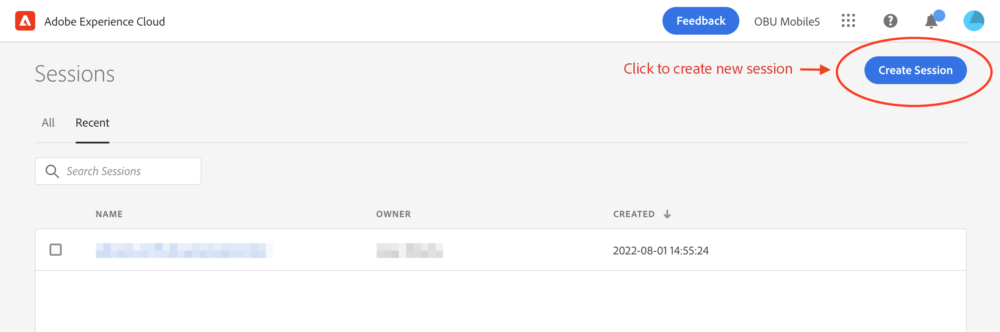
    - In the `Create New Session` dialog, review instructions, and proceed by selecting `Start`  
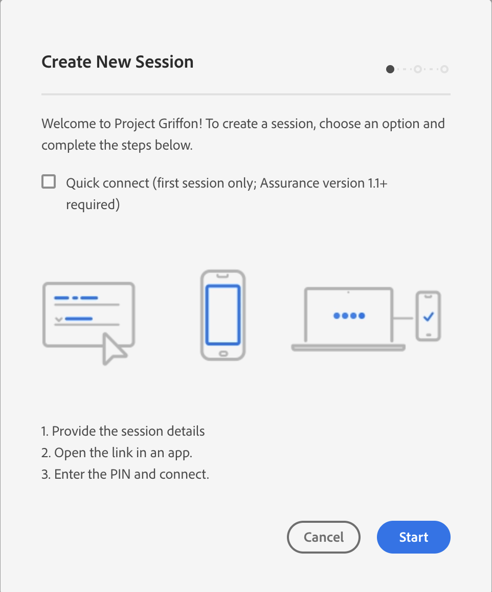

    - Enter a name to identify the session (can be any desired name) 
    - Use Base URL value: `aepedgebridge://`  
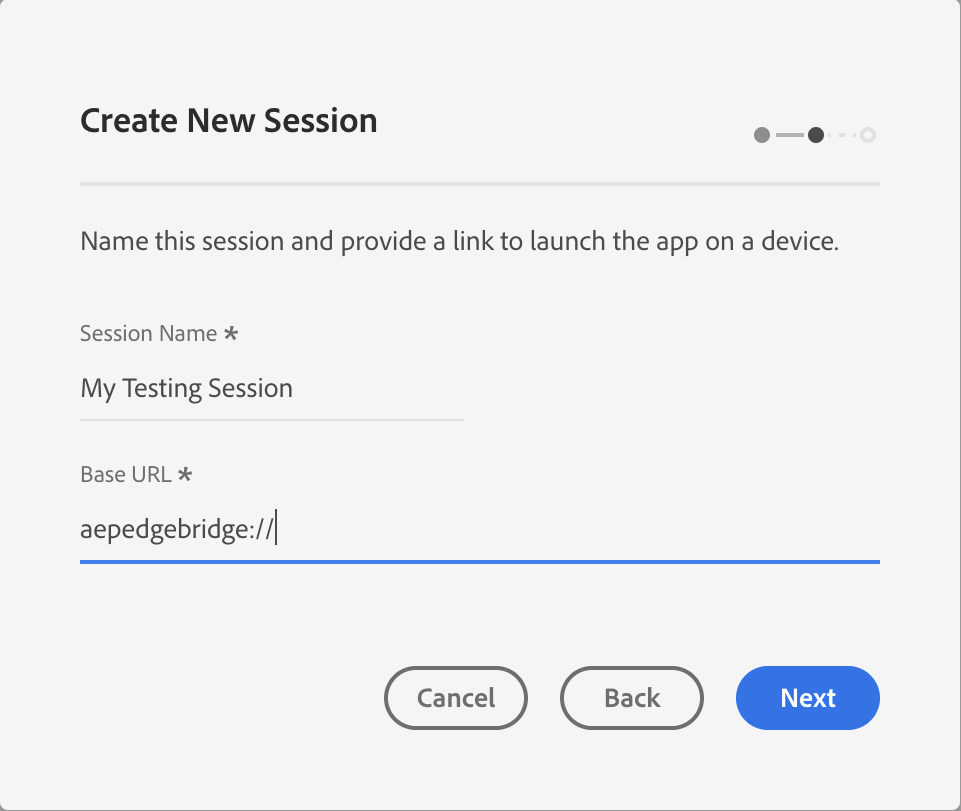

<details>
  <summary> What is a base URL? </summary><p>

> **Note**  
> The Base URL is the root definition used to launch your app from a URL (deep linking). A session URL is generated by which you may initiate the Assurance session. An example value might look like: `myapp://default`  
>
> Note that proper base URL configuration is required for Assurance QR code app launching to function. However, even without setting up deep linking on the application-side, it is still possible to connect to Assurance using the session link.
>
> If you do not know the URL or don't want to use it at this time, enter a placeholder URL like `test://`. 
>  
> In Xcode the app URL can be configured using these steps:
> 1. Select the project in the navigator.
> 2. Select the app target in the `Targets` section, in the project configuration window.
> 3. Select the `Info` tab.
> 4. Set the desired deep linking URL.
> 
> Please note that there is still code on the application side that is required for the app to respond to deep links; see the [guide on adding Assurance to your app](https://aep-sdks.gitbook.io/docs/foundation-extensions/adobe-experience-platform-assurance#add-the-aep-assurance-extension-to-your-app). For general implementation recommendations and best practices, see Apple's guide on [Defining a custom URL scheme for your app](https://developer.apple.com/documentation/xcode/defining-a-custom-url-scheme-for-your-app)


</p></details>


When presented with this window, the new Assurance session is created, and it is now possible to connect the app to your Assurance session.  
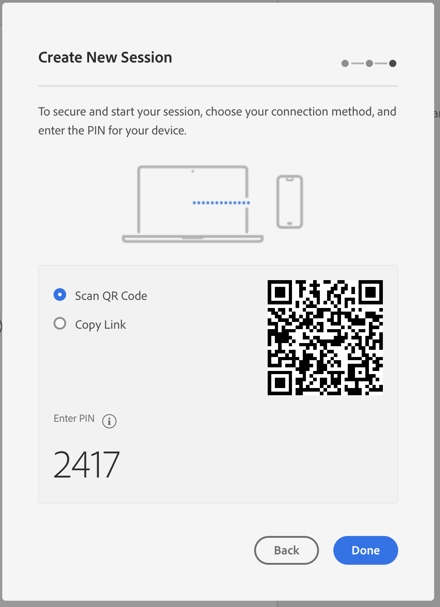
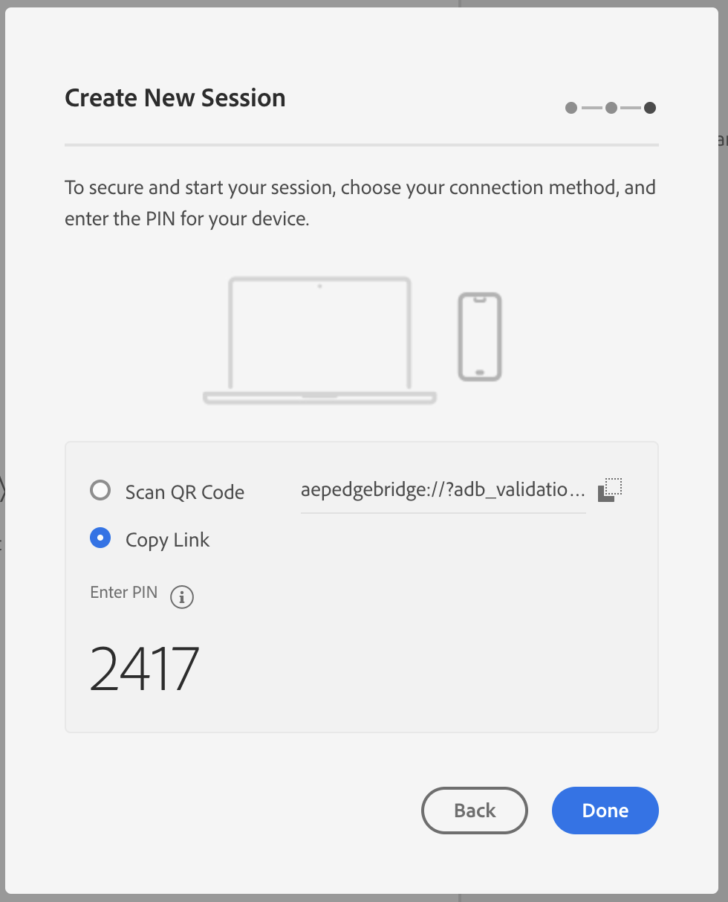

### 2. Connect to the app   

<details>
  <summary> Details on connecting to Assurance </summary><p>

There are two primary ways to connect an app instance to an Assurance session:
1. QR Code: available with `Scan QR Code` option selected. Only works with physical devices, as it requires a physical device's camera to scan the code. Note that this method requires setup on the application code side to allow for deep linking (see [Set up the Assurance session](#1-set-up-the-assurance-session)).

2. Session Link: available with `Copy Link` option selected. Works with both physical and simulated devices.

To access these connection methods, click `Session Details`:  
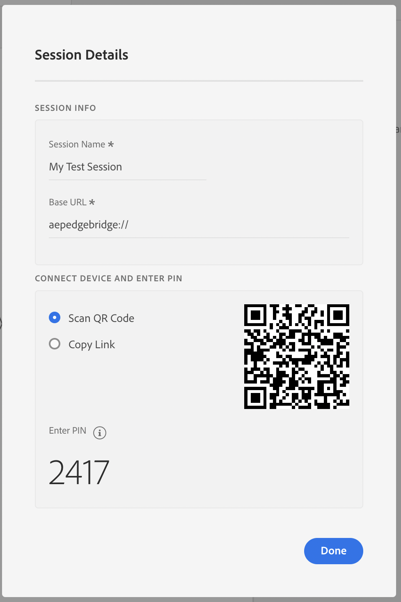
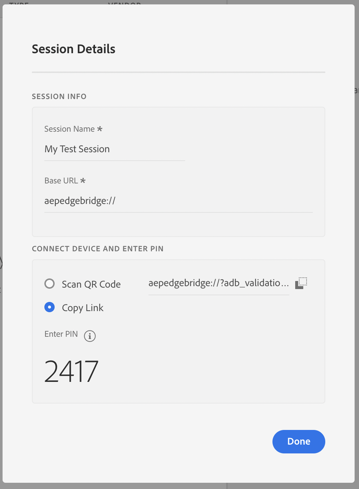

Note that it is possible to edit both the `Session Name` and `Base URL`; changes to the `Base URL` value will automatically be reflected in both QR code and session link.

</p></details>

To connect using session link:
1. Copy the session link; you can click the icon of a double overlapping box to the right of the link to copy
    - If using a physical device, it may be helpful to have a way to send this link to the device (ex: Airdrop, email, text, etc.)
2. Open the sample app and tap the Assurance button
3. Paste the Assurance session link copied from step 1 and tap `Connect`
    - If using the simulator, it is possible to enable the paste menu by clicking in the text field twice, with a slight pause between clicks.
4. App should open and show the Assurance PIN screen to authenticate the session connection; enter the PIN from the session details and tap `Connect`

<details>
  <summary> Connecting using QR code </summary><p>

To connect using QR code:
Prerequisites (see [Set up the Assurance session](#1-set-up-the-assurance-session) for details on QR code requirements):
- Running app using physical device with camera that can scan QR codes
- App URL for deep linking is configured
- App code for receiving link and connecting to Assurance is implemented

1. Use physical device's camera to scan the QR code, which when tapped, should trigger a confirmation dialog to open the app.
2. App should open and show the Assurance PIN screen to authenticate the session connection; enter the PIN from the session details and tap `Connect`

</p></details>

Once connected to Assurance, an Adobe Experience Platform icon will appear in the top right corner of the screen with a green dot indicating a connected session. In the web-based Assurance session, there is also an indicator in the top right that shows the number of connected sessions (which in this case should now show a green dot with "1 Client Connected", marked **1** in the screenshot below).

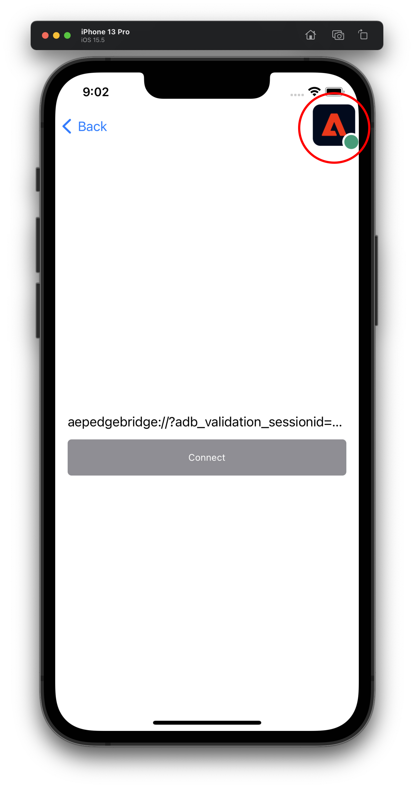
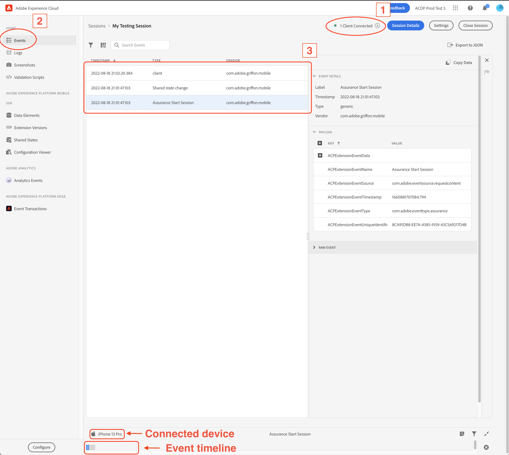  

Observe how in the Assurance session Events view (**2**), there are already events populating as a consequence of the connection of the mobile app to the Assurance session (**3**); the Assurance extension itself emits events about the session connection and subsequently captures these events to display in the web-based session viewer. You can expect Assurance to capture all events processed by the AEP SDK from all other extensions as well.  

### 3. Event transactions view - check for Edge Bridge events  
In order to see Edge Bridge events, in the connected app instance:
1. Trigger a `trackAction` and/or `trackState` within the app which the Edge Bridge extension will convert into Edge events. This event will be captured by the Assurance extension and shown in the web session viewer.

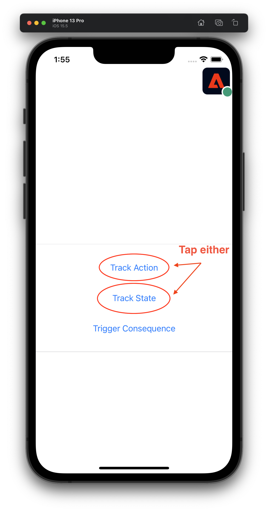

2. Click the `AnalyticsTrack` event (**1**) in the events table to see the event details in the right side window
3. Click the `RAW EVENT` dropdown (**2**) in the event details window to see the event data payload. 
4. Verify that the `contextdata` matches what was sent by the Analytics `trackAction`/`trackState` API.

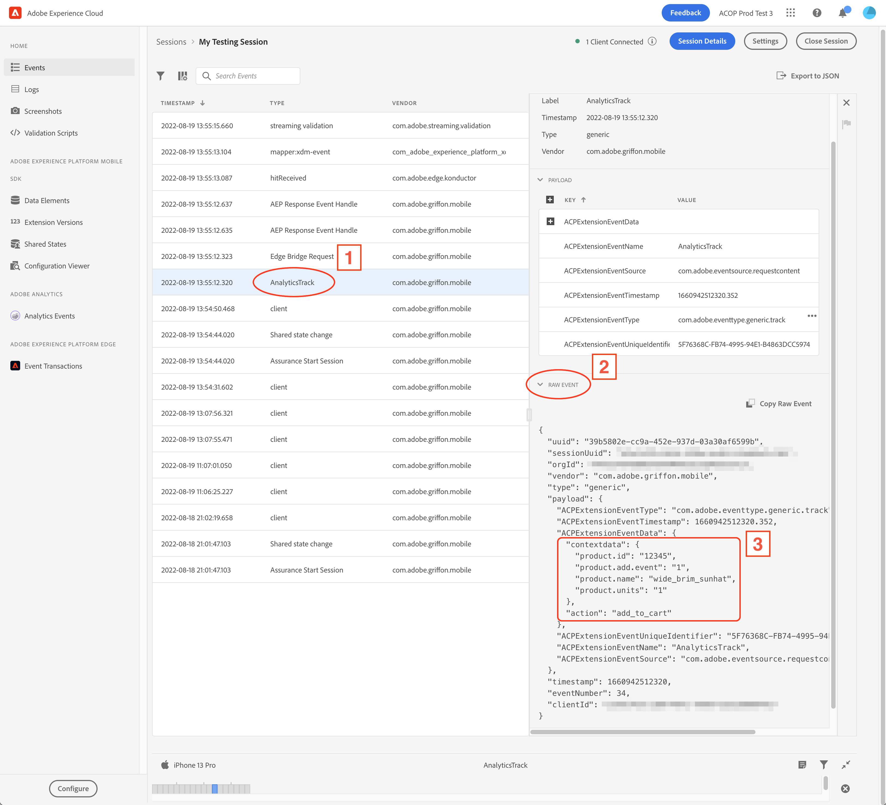

5. Now click the `Edge Bridge Request` event (**1**) in the events table
6. Click the `RAW EVENT` dropdown (**2**) in the event details window; notice the slight differences in the payload structure as a result of the `Edge Bridge Request` event conforming to the format of an Edge event.

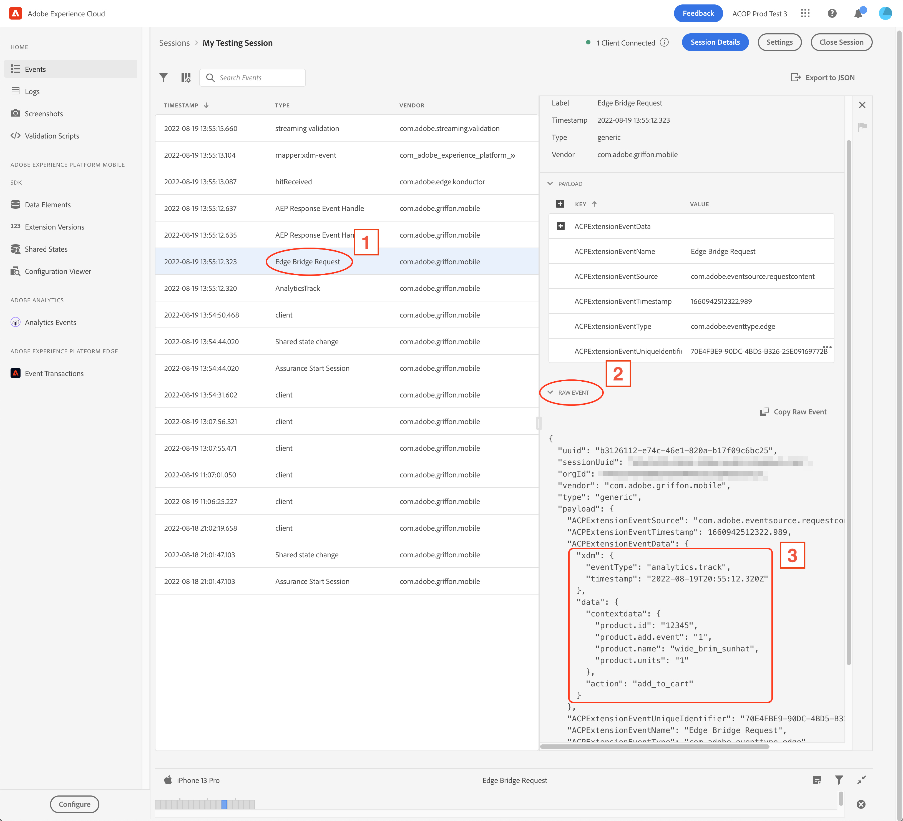

Notice the differences in event data structure and format between the two types of events: Analytics (left) vs Edge (right) via Edge Bridge extension
The top level EventType is converted from a `generic.track` to `edge` (that is, Analytics generic track event -> Edge event) (**1**). The Edge Bridge extension also populates the standard XDM field for event type (`eventType`) in the event data payload. Also notice that the `contextdata` has moved from directly under `EventData` to under the generic Edge XDM `data` property (**2**).

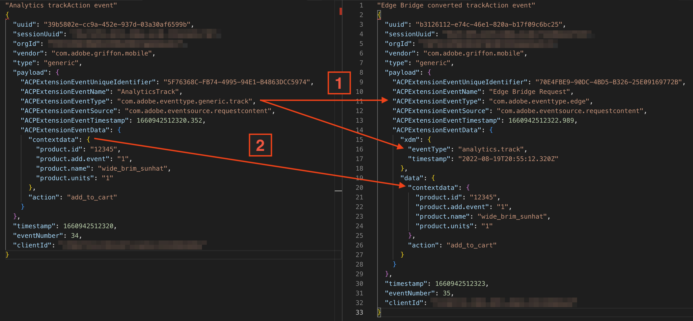

> **Note**
> The two new top level properties `xdm` and `data` are standard Edge event properties that are part of the Edge platform's XDM schema-based system for event data organization that enables powerful, customizable data processing. However, because the `contextdata` is not yet mapped to an XDM schema, it is not in a usable form for the Edge platform. We will solve this issue by mapping the event data to an XDM schema in the next section.


## Data prep mapping

<details>
  <summary> Data Prep background</summary><p>

Data Prep is an Adobe Experience Platform service which maps and transforms data to the [Experience Data Model (XDM)](https://experienceleague.adobe.com/docs/experience-platform/xdm/home.html).  Data Prep is configured from a Platform enabled [datastream](https://experienceleague.adobe.com/docs/experience-platform/edge/datastreams/overview.html) to map source data from the Edge Bridge mobile extension to the Platform Edge Network.

This guide covers how to map data sent from the Edge Bridge within the Data Collection UI.

For a quick overview of the capabilities of Data Prep, watch the following [video](https://experienceleague.adobe.com/docs/platform-learn/data-collection/edge-network/data-prep.html).

> **Note**
> The following documentation provides a comprehensive overview of the Data Prep capabilities:
> - [Data Prep overview](https://experienceleague.adobe.com/docs/experience-platform/data-prep/home.html)
> - [Data Prep mapping functions](https://experienceleague.adobe.com/docs/experience-platform/data-prep/functions.html)
> - [Handling data formats with Data Prep](https://experienceleague.adobe.com/docs/experience-platform/data-prep/data-handling.html)
>

</p></details>

In order to map the properties from both `trackAction` and `trackState` events in the same datastream, we need to combine their event data properties into a single JSON. For simplicity, the merged data structure has been provided below:

```json
{
  "xdm": {
    "eventType": "analytics.track",
    "timestamp": "2022-08-19T20:55:12.320Z"
  },
  "data": {
    "contextdata": {
      "product.add.event": "1",
      "product.view.event": "1",
      "product.id": "12345",
      "product.name": "wide_brim_sunhat",
      "product.units": "1"
    },
    "action": "add_to_cart",
    "state": "hats/sunhat/wide_brim_sunhat_id12345"
  }
}

```

1. Copy and paste the JSON data into the datastreams JSON input box (**1**). 
2. Verify the uploaded JSON matches what is displayed in the `Preview sample data` section (**2**) and click `Next` (**3**).

<details>
  <summary> Getting the JSON data from Assurance </summary><p>

1. Navigate back to your Assurance session for the Edge Bridge app and select the `Edge Bridge Request` event (**1**)
2. Open the `RAW EVENT` dropdown and click and drag to select the `ACPExtensionEventData` value as shown, then copy the selected value (right click the highlighted selection and choose `Copy`, or use the copy keyboard shortcut `CMD + C`)  

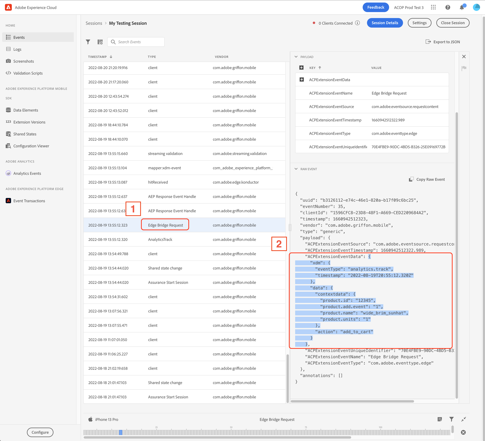  

> **Note**
> To merge events, you would look for properties under `data` and `contextdata` that are unique between events and include them in the final data payload.

</p></details>

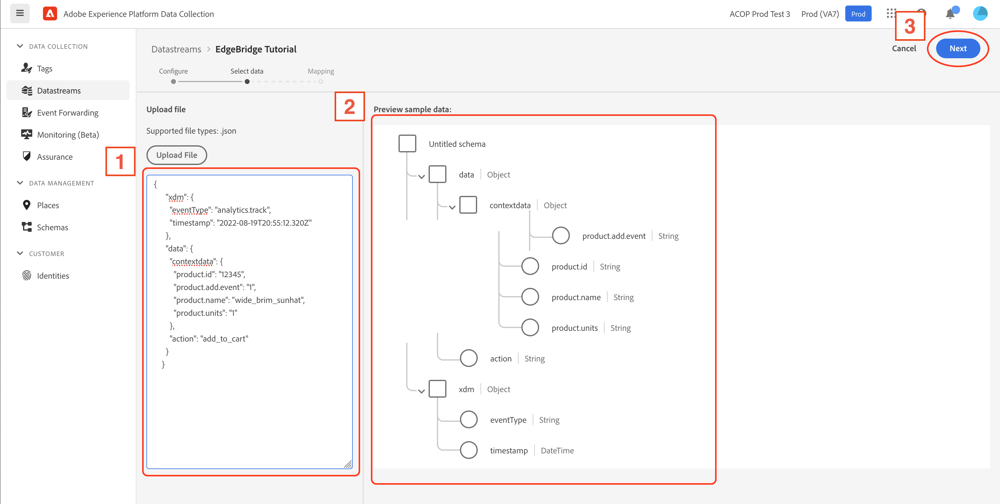  

3. Click the `Add new mapping` button (**1**).

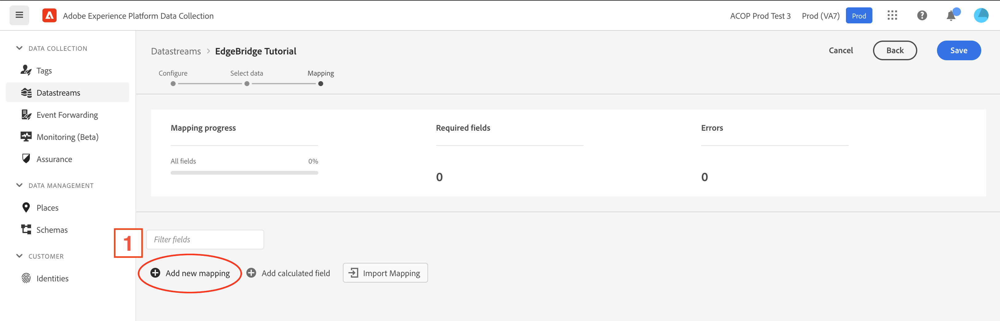  

4. A new entry for mapping will appear in the window; click the arrow button (**1**) next to the field `Select source field`.

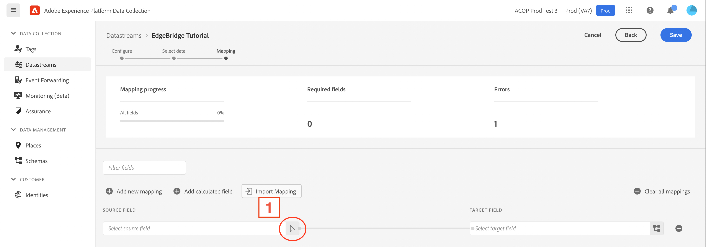  

5. In the JSON property viewer window, click the dropdown arrows next to `data` (**1**) and `contextdata` (**2**). 
6. Then select the first property to map, `product.add.event` (**3**) and click `Select` (**4**).

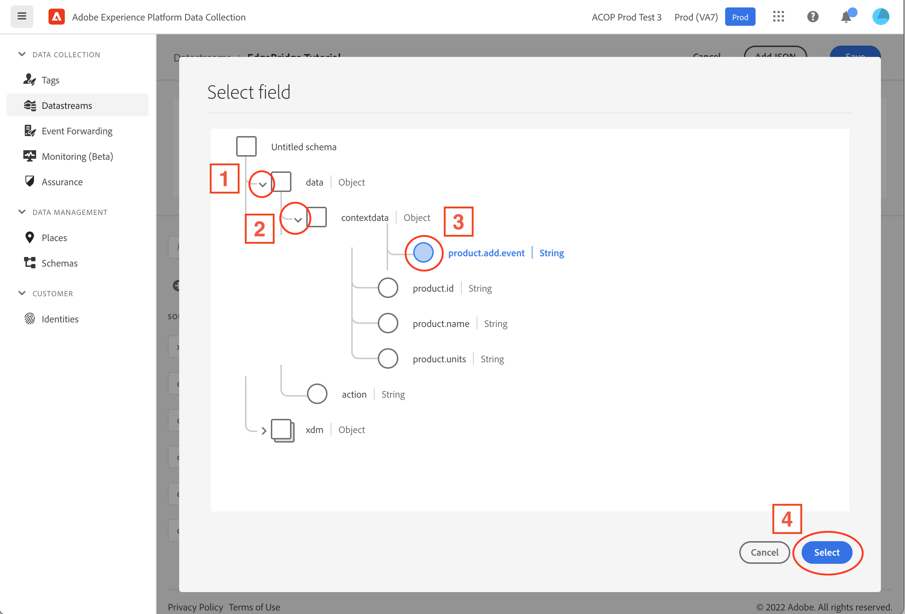  

Notice that in the property viewer, you can see the data hierarchy, where `data` is at the top, `contextdata` is one level down, and `product.add.event` is one level below that. This is nested data, which is a way to organize data in the JSON format. 

> **Info**
> The data mapper interprets the `.` character as nesting, which means if there are `.` characters in a property name that are not meant to be nesting, namely the ones in our current example: `product.add.event`, we need to escape this behavior by adding backslashes `\` before the `.` (**1**).

7. Add backslashes `\` before the `.` characters as shown below (**1**).

Now, we need to map this JSON property from the Edge Bridge event to its matching property in the XDM schema. 

8. Click the schema icon (**2**) to open the XDM property viewer window.

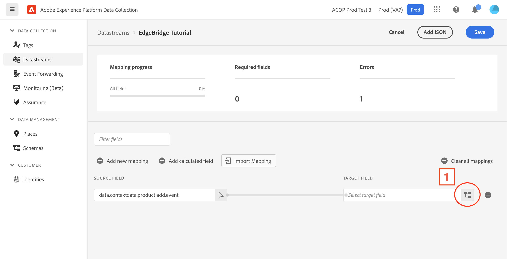  

9. In the XDM property viewer window, click the dropdown arrows next to `commerce` (**1**) and `productListAdds` (**2**). 
10. Then select the `value` property (**3**) and click `Select` (**4**).

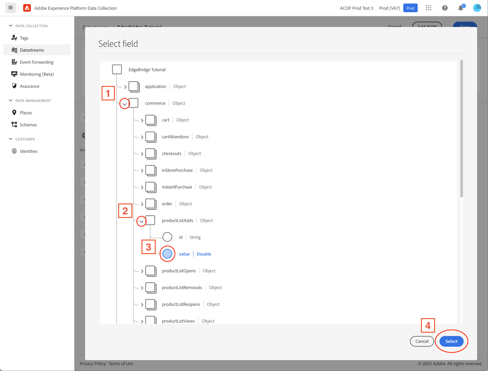  

11. Repeat this process, adding new mappings for all of the other properties on the JSON data side (except for the `timestamp` property which is handled automatically by Edge), finalizing the mappings like this:

| JSON Property                           | XDM Property                       | trackAction        | trackState         |
| --------------------------------------- | ---------------------------------- | ------------------ | ------------------ |
| data.contextdata.product\\.add\\.event  | commerce.productListAdds.value     | :white_check_mark: |                    |
| data.contextdata.product\\.view\\.event | commerce.productListViews.value    |                    | :white_check_mark: |
| data.contextdata.product\\.id           | productListItems.SKU               | :white_check_mark: | :white_check_mark: |
| data.contextdata.product\\.name         | productListItems.name              | :white_check_mark: | :white_check_mark: |
| data.contextdata.product\\.units        | productListItems.quantity          | :white_check_mark: |                    |


Follow the instructions in the guide on mapping data [using Data Prep for Data Collection](./map-track-data-using-data-prep.md)

## Validation with Assurance
Check mapping feedback in Event transactions view
