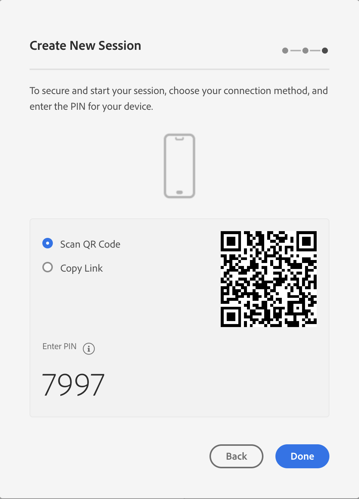

# AEP Analytics & Edge Bridge
## Overview
This hands-on tutorial provides end-to-end instructions for Mobile SDK customers on how  Edge Bridge can help easily migrate from AEPAnalytics to AEP.

There are other beginning states the customer can be in like using ACP Analytics, v4 extension, etc. These usages can potentially be migrated to AEP and from there, this tutorial can be applied afterwards. However, this should be determined on a case-by-case basis, as for example in the v4 extension case, it may be more effective to simply implement AEP extensions itself without the need for Edge Bridge migration path.

Tutorial setup:

Initial test app that is based on prerequisites (implements Analytics)
Final test app after all the tutorial steps have been implemented (implements EdgeBridge)

Tutorial steps:

      0. Prerequisites (set up Analytics report suite, mobile property, Assurance). List out required permissions for this tutorial: Analytics, Schema creation, Data Collection (Launch tags), Datastream view and edit, Assurance.

## Data Collection config instructions
Create XDM schema   
Configure Datastream, enable Analytics - 2 paths:   
    - same rsid(s) as in Analytics extension (if using Analytics + EdgeBridge this will cause double counting).  
    - different rsid(s) if the customer wants to start new or run the migration in a comparison mode (Analytics + EdgeBridge side by side).  

Install Edge Network & Edge Identity in Launch - Edge Bridge does not have a card here  
Analytics should remain installed in Launch for production app versions.  
Publish the changes  

## Client-side implementation
### 1. Install Edge Bridge using dependency manager
To install EdgeBridge, use the currently the supported installation options:
### iOS
#### [CocoaPods](https://guides.cocoapods.org/using/using-cocoapods.html)

```ruby
# Podfile
use_frameworks!

# For app development, include all the following pods
target 'YOUR_TARGET_NAME' do
  pod 'AEPAnalytics'
  pod 'AEPCore'
  pod 'AEPIdentity'
  pod 'AEPLifecycle'  
  pod 'AEPServices'
  
  pod 'AEPEdgeBridge'

  pod 'AEPAssurance', '~> 3.0.0'
end
```

#### [Swift Package Manager](https://github.com/apple/swift-package-manager)

To add the AEPEdgeBridge Package to your application, from the Xcode menu select:

`File > Swift Packages > Add Package Dependency...`

Enter the URL for the AEPEdgeIdentity package repository: `https://github.com/adobe/aepsdk-edgebridge-ios.git`. 

When prompted, input a specific version or a range of version for Version rule.

Alternatively, if your project has a `Package.swift` file, you can add AEPEdgeBridge directly to your dependencies:

```
dependencies: [
	.package(url: "https://github.com/adobe/aepsdk-edgebridge-ios.git", .upToNextMajor(from: "1.0.0"))
],
targets: [
   	.target(name: "YourTarget",
    		dependencies: ["AEPEdgeBridge"],
          	path: "your/path")
]
```

### 2. Imports and extension registration diff  
In your AppDelegate file, import the newly installed extension and register it with `MobileCore`:

```swift
import UIKit
import AEPCore
import AEPIdentity
import AEPAnalytics
import AEPAssurance
import AEPLifecycle
import AEPServices
import AEPEdgeBridge // <-- Newly added

func application(_ application: UIApplication, didFinishLaunchingWithOptions launchOptions: [UIApplication.LaunchOptionsKey: Any]?) -> Bool {

        MobileCore.setLogLevel(.trace)
        MobileCore.registerExtensions([
            Identity.self, 
            Analytics.self, 
            Lifecycle.self, 
            Assurance.self
            EdgeBridge.self // <-- Newly added
        ], {
            // Use the App ID assigned to this application via Adobe Data Collection UI
            MobileCore.configureWith(appId: self.ENVIRONMENT_FILE_ID)
        })
        return true
    }
```

### 3. Run app   
In Xcode, select the app target you want to run, and the destination device to run it on (either simulator or physical device). Then press the play button.

You should see your application running on the device you selected, with logs being displayed in the console in Xcode. 

> **Note**
> If the debug console area is not shown by default, activate it by selecting:  
> View -> Debug Area -> Show Debug Area

### 4. TrackAction/TrackState implementation examples   
With Edge Bridge extension successfully installed and registered, you can make  `trackAction` and `trackState` calls, which will be captured by Edge Bridge extension and sent to the Edge network.

#### Swift
```swift
let actionData: [String: Any] = [
    "product.id": "12345", 
    "product.add.event": "1", 
    "product.name": "wide_brim_sunhat", 
    "product.units": "1"
]
MobileCore.track(action: "add_to_cart", data: actionData)

let stateData: [String: Any] = [
    "product.name": "wide_brim_sunhat", 
    "product.id": "12345", 
    "product.view.event": "1"
]
MobileCore.track(state: "hats/sunhat/wide_brim_sunhat_id12345", data: stateData)
```

## Initial validation with Assurance
### 1. Set up the Assurance session  
1. Access Assurance at [​https://experience.adobe.com/griffon](https://experience.adobe.com/griffon)
2. Log in using your Adobe ID credentials for the Experience Cloud.
3. Click **Create Session** in the top right.

4. In the **Create New Session** dialog, review instructions, and proceed by selecting **Start**

Click **Start**  


Enter a name to identify the session (can be any desired name), then provide a Base URL (used for deep linking into your app, and required when using the QR code method of connecting to Assurance). If you do not know the URL or don't want to use it at this time, enter a placeholder URL like `test://`. Click Next.  


> **Note**  
> The Base URL is the root definition used to launch your app from a URL. A session URL is generated by which you may initiate the Assurance session. An example value might look like: myapp://default  
> In the Base URL field, type your app's base deep link definition.  
> For example, in Xcode the app URL can be configured using these steps:
> 1. Select the project in the navigator
> 2. Select the app target in the `Targets` section, in the project configuration window
> 3. Select the `Info` tab
> 4. Set the desired deep linking URL
> 
> Please note that there is still code on the application side that is required for the app to respond to deep links; see the [guide on adding Assurance to your app](https://aep-sdks.gitbook.io/docs/foundation-extensions/adobe-experience-platform-assurance#add-the-aep-assurance-extension-to-your-app). For general implementation recommendations and best practices, see Apple's guide on [Defining a custom URL scheme for your app](https://developer.apple.com/documentation/xcode/defining-a-custom-url-scheme-for-your-app)

When presented with this window, the new session should be created, and it is now possible to connect the app to your Assurance session  


### 2. Connect to the app   


### 3. Event transactions view - check for Edge Bridge events  


## Data prep mapping
Copy data blob from Assurance (hint on copy from logs)  
Add mapping in Data Prep UI  

## Validation with Assurance
Check mapping feedback in Event transactions view
