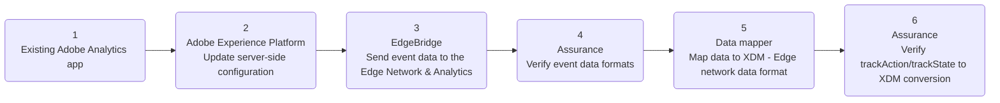
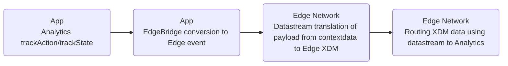

# Migrating from Analytics mobile extension to the Edge Network using the EdgeBridge extension <!-- omit in toc -->

## Table of Contents <!-- omit in toc -->
- [Overview](#overview)
  - [Environment](#environment)
  - [Prerequisites](#prerequisites)
  - [Adobe Experience Platform setup](#adobe-experience-platform-setup)
- [Client-side implementation](#client-side-implementation)
  - [1. Get a copy of the files (code and tutorial app)](#1-get-a-copy-of-the-files-code-and-tutorial-app)
  - [1. Install Edge Bridge using dependency manager (CocoaPods)](#1-install-edge-bridge-using-dependency-manager-cocoapods)
  - [2. Update Tutorial App Code to Enable EdgeBridge functionality](#2-update-tutorial-app-code-to-enable-edgebridge-functionality)
  - [3. Run app](#3-run-app)
  - [4. TrackAction/TrackState implementation examples](#4-trackactiontrackstate-implementation-examples)
- [Initial validation with Assurance](#initial-validation-with-assurance)
  - [1. Set up the Assurance session](#1-set-up-the-assurance-session)
  - [2. Connect to the app](#2-connect-to-the-app)
  - [3. Event transactions view - check for Edge Bridge events](#3-event-transactions-view---check-for-edge-bridge-events)
- [Data prep mapping](#data-prep-mapping)
- [Validating the implementation](#validating-the-implementation)

## Overview
This hands-on tutorial provides end-to-end instructions on how to migrate from sending data to Analytics to sending data to the Edge Network using the EdgeBridge mobile extension.



### Environment
- macOS machine with a recent version of Xcode installed.
- Cocoapods installed.

### Prerequisites
- A timestamp enabled report suite is configured for mobile data collection.
- A tag (also known as mobile property) is configured in Data Collection UI which has Adobe Analytics extension installed and configured.

### Adobe Experience Platform setup
Before any app changes we need to set up some configuration items on the Adobe Experience Platform (AEP) side. The end goal of this section is to create a mobile property that controls the configuration settings for the various AEP extensions used in this tutorial.

If you don't have an existing mobile property, see the [instructions on how to set up a new property](https://github.com/adobe/aepsdk-edge-ios/blob/tutorial-send-event/Documentation/Tutorials/edge-send-event-tutorial.md#1-create-a-schema).

The following AEP extension configurations should be installed:  

<details>
  <summary> Adobe Analytics </summary><p>

Open the **Catalog** and install the `Adobe Analytics` extension configuration.

  

</p></details>

<details>
  <summary> AEP Assurance </summary><p>

Open the **Catalog** and install the `AEP Assurance` extension configuration.

  

</p></details>

<details>
  <summary> Adobe Experience Platform Edge Network </summary><p>

Go back to the `Catalog` and install the `Adobe Experience Platform Edge Network` extension configuration.

  

In the extension configuration settings window, set the datastream for each environment (**1**) to the one created for this tutorial. Then click `Save` (**2**)

  

</p></details>

<details>
  <summary> Identity </summary><p>

Open the `Catalog` and install the `Identity` extension configuration. There are no settings for this extension.

  

</p></details>

<details>
  <summary> Consent </summary><p>

Open the `Catalog` and install the `Consent` extension configuration.

  

In the extension configuration settings window, the `Default Consent Level` should be set to `Yes` by default (**1**); for the tutorial app this setting is fine as-is, however when using this configuration in production apps, it should reflect the requirements of the company's actual data collection policy for the app. 

  

</p></details>

The following cards should be visible after all the extensions are installed: 

  

## Client-side implementation
### 1. Get a copy of the files (code and tutorial app)
1. Open the code repository: https://github.com/adobe/aepsdk-edgebridge-ios
2. Click **Code** in the top right 
3. In the window that opens, click **Download ZIP**; by default it should land in your **Downloads** folder.
   - Optionally, move the ZIP to your **Documents** folder
4. Unzip the archived file by double clicking it, and keep this Finder window open, as we will need it later.

Now we can use the tutorial app to go through the changes required to install the Edge Bridge extension.

1. Open the Terminal app
   - Applications -> Utilities -> Terminal
   - Open Spotlight search (CMD + Space) and search for "terminal"
2. Type the following characters, but do not press return yet: `c` + `d` + `SPACE`  
You should see the following in your terminal: "cd " (the space after `cd` is important!).
```bash
cd 
```
7. Return to your Finder window that has the unzipped repository folder. Click and drag the folder into your Terminal window that has the `cd ` command typed. You should see something like: `cd /Users/tim/Documents/aepsdk-edgebridge-ios`  
8. Then press `return` to execute the command.

<details>
  <summary> What is <code>cd</code>? What did I just do? </summary><p>

`cd` is the terminal command for change directory; the command above changes your terminal's active directory to the repository we just copied.

The long string after is the full path (kind of like an address) to the code repository folder: `/Users/tim/Documents/aepsdk-edgebridge-ios`, taking our terminal window to the newly created repository!

</p></details>

Now that we're in the project directory, there's some setup we have to do; the app depends on packages which are not installed with the repository. To install them, run the command:

```bash
pod update
```

<details>
  <summary> Using Swift package manager instead? </summary><p>

**Swift Package Manager**
This tutorial assumes a project using Cocoapods for package dependency management, but if following along with a project that uses Swift package manager, refer to the [README for instructions on how to add the EdgeBridge package](../../README.md#swift-package-managerhttpsgithubcomappleswift-package-manager).

</p></details>

You should see the dependency manager CocoaPods installing the various packages required by the project. 

<details>
  <summary> Expected output </summary><p>

```
tim@Tims-MacBook-Pro aepsdk-edgebridge-ios % pod update
Update all pods
Updating local specs repositories
Analyzing dependencies
Downloading dependencies
Installing AEPAssurance (3.0.1)
Installing AEPCore (3.7.1)
Installing AEPEdge (1.4.1)
Installing AEPEdgeIdentity (1.1.0)
Installing AEPLifecycle (3.7.1)
Installing AEPRulesEngine (1.2.0)
Installing AEPServices (3.7.1)
Installing SwiftLint (0.44.0)
Generating Pods project
Integrating client project
Pod installation complete! There are 6 dependencies from the Podfile and 8 total pods installed.
tim@Tims-MacBook-Pro aepsdk-edgebridge-ios % 
```

</p></details>

### 1. Install Edge Bridge using dependency manager (CocoaPods)
Our next task is actually modifying the file that controls the package dependencies, adding the new extensions that will enable the Edge Bridge extension to function.

Open the project using the command:
```bash
open AEPEdgeBridge.xcworkspace
```

This should automatically open the Xcode IDE. In Xcode:
1. Click the dropdown chevron next to `Pods` in the left-side navigation panel.
2. Click the `Podfile` file.
3. Replace the section: 

```ruby
target 'EdgeBridgeTutorialApp' do
  pod 'AEPAnalytics'
  pod 'AEPCore'
  pod 'AEPServices'
end
```
With:

```ruby
target 'EdgeBridgeTutorialApp' do
  pod 'AEPAnalytics'
  pod 'AEPAssurance'
  pod 'AEPCore'
  pod 'AEPEdge'
  pod 'AEPEdgeConsent'
  pod 'AEPEdgeIdentity'
  pod 'AEPLifecycle'
  pod 'AEPServices'
end
```

4. Go back to your terminal window and run:
```bash
pod update
```
Cocoapods will use this updated configuration file to install the new packages (including the EdgeBridge extension itself!), which will allow us to add new functionality in the app's code. 

### 2. Update Tutorial App Code to Enable EdgeBridge functionality
There are two files we need to update to enable the EdgeBridge extension. 
1. Click the dropdown chevron next to `EdgeBridgeTutorialApp` in the left-side navigation panel.
2. Click the dropdown chevron next to the `EdgeBridgeTutorialApp` folder.
3. Click the `AppDelegate.swift` file.

Inside you will see code blocks for this tutorial that are greyed out, because they are commented out. They are marked by the header and footer `EdgeBridge Tutorial - code section n/m` (where `n` is the current section and `m` is the total number of sections in the file).

To uncomment the section and activate the code, simply add a forward slash at the front of the header:
```swift
/* EdgeBridge Tutorial - code section 1/2
```
To:
```swift
//* EdgeBridge Tutorial - code section 1/2
```
Make sure to uncomment all sections within the file (the total will tell you how many sections there are).

<details>
  <summary> What am I uncommenting in <code>AppDelegate.swift</code>? </summary><p>

**Section 1**: imports the EdgeBridge extension and other AEP extensions that enable its functionality and power other features. This makes it available to use in the code below.

**Section 2**: registers the extensions with Core (which contains all of the baseline capabilities required to run Adobe extensions), getting them ready to run in the app.

**Section 3**: Enables deep linking to connect to Assurance (which we will cover in depth in a later section); this is for iOS versions 12 and below.

</p></details>

Repeat this process for the `SceneDelegate.swift` file.

<details>
  <summary> What am I uncommenting in <code>SceneDelegate.swift</code>? </summary><p>

**Section 1**: imports the Assurance extension for use in the code below.

**Section 2**: Enables deep linking to connect to Assurance (which we will cover in depth in a later section); this is for iOS versions 13 and above.

</p></details>

### 3. Run app   
In Xcode, select the app target you want to run, and the destination device to run it on (either simulator or physical device). Then press the play button.

You should see your application running on the device you selected, with logs being displayed in the console in Xcode. 

> **Note**
> If the debug console area is not shown by default, activate it by selecting:  
> View -> Debug Area -> Show Debug Area

### 4. TrackAction/TrackState implementation examples   
With Edge Bridge extension successfully installed and registered, you can make the regular Analytics `trackAction` and `trackState` calls, which will be captured by Edge Bridge extension and sent to the Edge network.

Check `ContentView.swift` for implementation examples of both APIs. You can see the data payloads that are to be sent with the calls.

## Initial validation with Assurance
Assurance is the AEP tool for inspecting all events that Adobe extensions send out, in real time. It will allow us to see the flow of events, including the EdgeBridge conversion of `trackAction`/`trackState`.

### 1. Set up the Assurance session  
1. In the browser, navigate to [Assurance](https://experience.adobe.com/griffon) and login using your Adobe ID credentials.
2. Create a new session (or use an existing one if available) 
    - Click `Create Session` in the top right.

    - In the `Create New Session` dialog, review instructions, and proceed by selecting `Start`  


    - Enter a name to identify the session (can be any desired name) 
    - Use Base URL value: `aepedgebridge://`  


<details>
  <summary> What is a base URL? </summary><p>

> **Note**  
> The Base URL is the root definition used to launch your app from a URL (deep linking). A session URL is generated by which you may initiate the Assurance session. An example value might look like: `myapp://default`  
>
> Note that proper base URL configuration is required for Assurance QR code app launching to function. However, even without setting up deep linking on the application-side, it is still possible to connect to Assurance using the session link.
>
> If you do not know the URL or don't want to use it at this time, enter a placeholder URL like `test://`. 
>  
> In Xcode the app URL can be configured using these steps:
> 1. Select the project in the navigator.
> 2. Select the app target in the `Targets` section, in the project configuration window.
> 3. Select the `Info` tab.
> 4. Set the desired deep linking URL.
> 
> Please note that there is still code on the application side that is required for the app to respond to deep links; see the [guide on adding Assurance to your app](https://aep-sdks.gitbook.io/docs/foundation-extensions/adobe-experience-platform-assurance#add-the-aep-assurance-extension-to-your-app). For general implementation recommendations and best practices, see Apple's guide on [Defining a custom URL scheme for your app](https://developer.apple.com/documentation/xcode/defining-a-custom-url-scheme-for-your-app)


</p></details>


When presented with this window, the new Assurance session is created, and it is now possible to connect the app to your Assurance session.  


### 2. Connect to the app   

<details>
  <summary> Details on connecting to Assurance </summary><p>

There are two primary ways to connect an app instance to an Assurance session:
1. QR Code: available with `Scan QR Code` option selected. Only works with physical devices, as it requires a physical device's camera to scan the code. Note that this method requires setup on the application code side to allow for deep linking (see [Set up the Assurance session](#1-set-up-the-assurance-session)).

2. Session Link: available with `Copy Link` option selected. Works with both physical and simulated devices.

To access these connection methods, click `Session Details`:  


Note that it is possible to edit both the `Session Name` and `Base URL`; changes to the `Base URL` value will automatically be reflected in both QR code and session link.

</p></details>

To connect to Assurance, we will use the session link:
1. Copy the session link; you can click the icon of a double overlapping box to the right of the link to copy it.
    - If using a physical device, it may be helpful to have a way to send this link to the device (ex: Airdrop, email, text, etc.)
2. Open Safari (or other web browser).
3. Paste the Assurance session link copied from step 1 into the URL/search text field and enter.
    - If using the simulator, it is possible to enable the paste menu by clicking in the text field twice, with a slight pause between clicks.
4. A new dialog box should open requesting to open the tutorial app, tap **OK**.
4. App should open and show the Assurance PIN screen to authenticate the session connection; enter the PIN from the session details and tap **Connect**.

<details>
  <summary> Connecting using QR code </summary><p>

To connect using QR code:
Prerequisites (see [Set up the Assurance session](#1-set-up-the-assurance-session) for details on QR code requirements):
- Running app using physical device with camera that can scan QR codes
- App URL for deep linking is configured
- App code for receiving link and connecting to Assurance is implemented

1. Use physical device's camera to scan the QR code, which when tapped, should trigger a confirmation dialog to open the app.
2. App should open and show the Assurance PIN screen to authenticate the session connection; enter the PIN from the session details and tap `Connect`

</p></details>

Once connected to Assurance, in the tutorial app, an Adobe Experience Platform icon will appear in the top right corner of the screen with a green dot indicating a connected session. In the web-based Assurance session, there is also an indicator in the top right that shows the number of connected sessions (which in this case should now show a green dot with "1 Client Connected" (**1**)).


  

Observe how in the Assurance session Events view (**2**), there are already events populating as a consequence of the connection of the mobile app to the Assurance session (**3**); the Assurance extension itself emits events about the session connection and subsequently captures these events to display in the web-based session viewer. You can expect Assurance to capture all events processed by the AEP SDK from all other extensions as well.  

### 3. Event transactions view - check for Edge Bridge events  
In order to see Edge Bridge events, in the connected app instance:
1. Trigger a `trackAction` and/or `trackState` within the app which the Edge Bridge extension will convert into Edge events. This event will be captured by the Assurance extension and shown in the web session viewer.


2. Click the `AnalyticsTrack` event (**1**) in the events table to see the event details in the right side window
3. Click the `RAW EVENT` dropdown (**2**) in the event details window to see the event data payload. 
4. Verify that the `contextdata` matches what was sent by the Analytics `trackAction`/`trackState` API.


5. Now click the `Edge Bridge Request` event (**1**) in the events table
6. Click the `RAW EVENT` dropdown (**2**) in the event details window; notice the slight differences in the payload structure as a result of the `Edge Bridge Request` event conforming to the format of an Edge event.


Notice the differences in event data structure and format between the two types of events: Analytics (left) vs Edge (right) via Edge Bridge extension
The top level EventType is converted from a `generic.track` to `edge` (that is, Analytics generic track event -> Edge event) (**1**). The Edge Bridge extension also populates the standard XDM field for event type (`eventType`) in the event data payload. Also notice that the `contextdata` has moved from directly under `EventData` to under the generic Edge XDM `data` property (**2**).


> **Note**
> The two new top level properties `xdm` and `data` are standard Edge event properties that are part of the Edge platform's XDM schema-based system for event data organization that enables powerful, customizable data processing. However, because the `contextdata` is not yet mapped to an XDM schema, it is not in a usable form for the Edge platform. We will solve this issue by mapping the event data to an XDM schema in the next section.


## Data prep mapping

<details>
  <summary> Data Prep background</summary><p>

Data Prep is an Adobe Experience Platform service which maps and transforms data to the [Experience Data Model (XDM)](https://experienceleague.adobe.com/docs/experience-platform/xdm/home.html).  Data Prep is configured from a Platform enabled [datastream](https://experienceleague.adobe.com/docs/experience-platform/edge/datastreams/overview.html) to map source data from the Edge Bridge mobile extension to the Platform Edge Network.

This guide covers how to map data sent from the Edge Bridge within the Data Collection UI.

For a quick overview of the capabilities of Data Prep, watch the following [video](https://experienceleague.adobe.com/docs/platform-learn/data-collection/edge-network/data-prep.html).

> **Note**
> The following documentation provides a comprehensive overview of the Data Prep capabilities:
> - [Data Prep overview](https://experienceleague.adobe.com/docs/experience-platform/data-prep/home.html)
> - [Data Prep mapping functions](https://experienceleague.adobe.com/docs/experience-platform/data-prep/functions.html)
> - [Handling data formats with Data Prep](https://experienceleague.adobe.com/docs/experience-platform/data-prep/data-handling.html)
>

</p></details>

In order to map the properties from both `trackAction` and `trackState` events in the same datastream, we need to combine their event data properties into a single JSON. For simplicity, the merged data structure has been provided below:

```json
{
  "xdm": {
    "eventType": "analytics.track",
    "timestamp": "2022-08-19T20:55:12.320Z"
  },
  "data": {
    "contextdata": {
      "product.add.event": "1",
      "product.view.event": "1",
      "product.id": "12345",
      "product.name": "wide_brim_sunhat",
      "product.units": "1"
    },
    "action": "add_to_cart",
    "state": "hats/sunhat/wide_brim_sunhat_id12345"
  }
}

```

1. Copy and paste the JSON data into the datastreams JSON input box (**1**). 
2. Verify the uploaded JSON matches what is displayed in the `Preview sample data` section (**2**) and click `Next` (**3**).

<details>
  <summary> Getting the JSON data from Assurance </summary><p>

1. Navigate back to your Assurance session for the Edge Bridge app and select the `Edge Bridge Request` event (**1**)
2. Open the `RAW EVENT` dropdown and click and drag to select the `ACPExtensionEventData` value as shown, then copy the selected value (right click the highlighted selection and choose `Copy`, or use the copy keyboard shortcut `CMD + C`)  

  

> **Note**
> To merge events, you would look for properties under `data` and `contextdata` that are unique between events and include them in the final data payload.

</p></details>

  

3. Click the `Add new mapping` button (**1**).

  

4. A new entry for mapping will appear in the window; click the arrow button (**1**) next to the field `Select source field`.

  

5. In the JSON property viewer window, click the dropdown arrows next to `data` (**1**) and `contextdata` (**2**). 
6. Then select the first property to map, `product.add.event` (**3**) and click `Select` (**4**).

  

Notice that in the property viewer, you can see the data hierarchy, where `data` is at the top, `contextdata` is one level down, and `product.add.event` is one level below that. This is nested data, which is a way to organize data in the JSON format. 

> **Info**
> The data mapper interprets the `.` character as nesting, which means if there are `.` characters in a property name that are not meant to be nesting, namely the ones in our current example: `product.add.event`, we need to escape this behavior by adding backslashes `\` before the `.` (**1**).

7. Add backslashes `\` before the `.` characters as shown below (**1**).

Now, we need to map this JSON property from the Edge Bridge event to its matching property in the XDM schema. 

8. Click the schema icon (**2**) to open the XDM property viewer window.

  

9. In the XDM property viewer window, click the dropdown arrows next to `commerce` (**1**) and `productListAdds` (**2**). 
10. Then select the `value` property (**3**) and click `Select` (**4**).

  

11. Repeat this process, adding new mappings for all of the other properties on the JSON data side (except for the `timestamp` property which is handled automatically by Edge), finalizing the mappings like this:

| JSON Property                           | XDM Property                       | trackAction        | trackState         |
| --------------------------------------- | ---------------------------------- | ------------------ | ------------------ |
| data.contextdata.product\\.add\\.event  | commerce.productListAdds.value     | :white_check_mark: |                    |
| data.contextdata.product\\.view\\.event | commerce.productListViews.value    |                    | :white_check_mark: |
| data.contextdata.product\\.id           | productListItems.SKU               | :white_check_mark: | :white_check_mark: |
| data.contextdata.product\\.name         | productListItems.name              | :white_check_mark: | :white_check_mark: |
| data.contextdata.product\\.units        | productListItems.quantity          | :white_check_mark: |                    |

12. After completing all the mappings, click **Save**.

## Validating the implementation
Now that the mapping is set up in the datastream, we have the full pathway of data:


Check mapping feedback in Event transactions view
