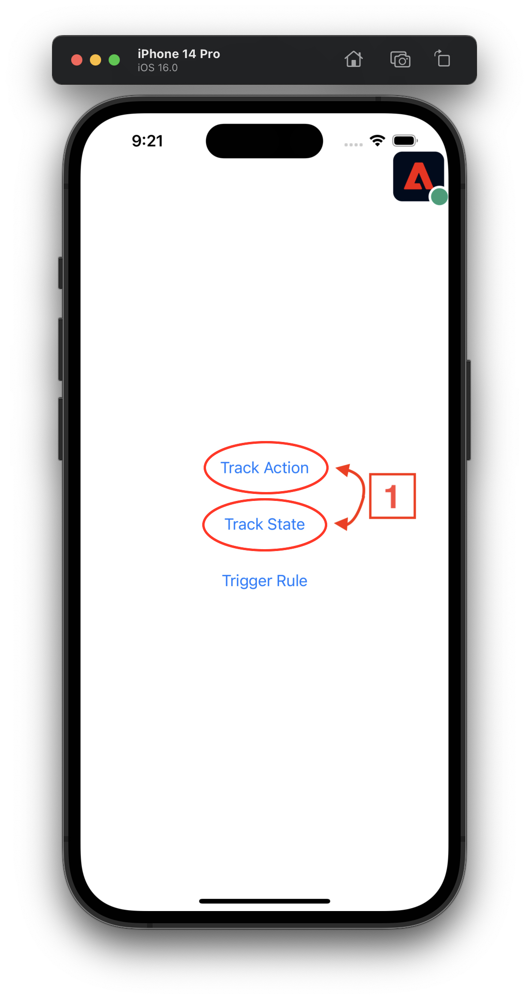
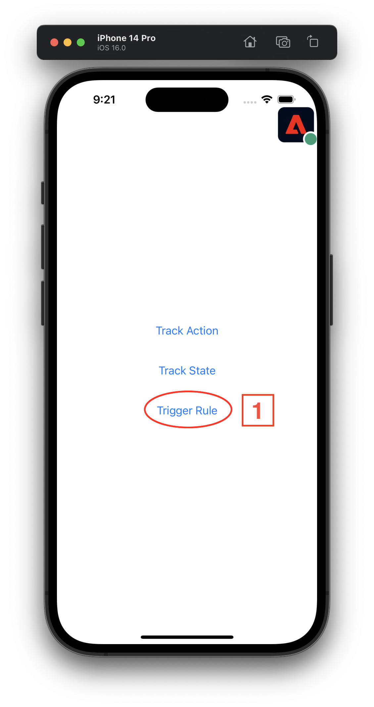
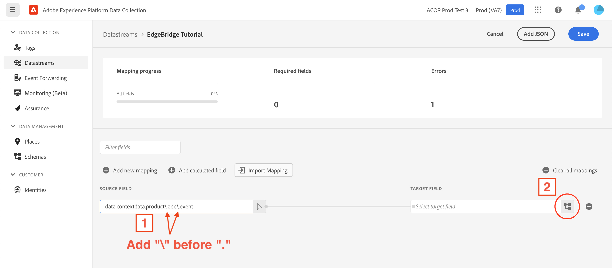
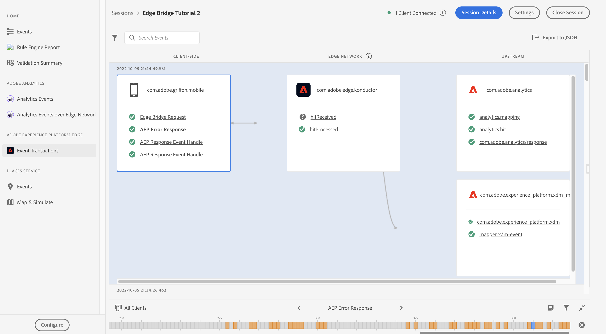

# Migrating from Analytics mobile extension to the Edge Network using the Edge Bridge extension <!-- omit in toc -->

## Table of Contents <!-- omit in toc -->
- [Overview](#overview)
  - [Environment](#environment)
  - [Prerequisites](#prerequisites)
  - [Adobe Experience Platform setup](#adobe-experience-platform-setup)
  - [1. Set up mobile property](#1-set-up-mobile-property)
  - [2. Configure a Rule to forward PII events to Edge Network](#2-configure-a-rule-to-forward-pii-events-to-edge-network)
- [Client-side implementation](#client-side-implementation)
  - [1. Get a copy of the files (code and tutorial app)](#1-get-a-copy-of-the-files-code-and-tutorial-app)
  - [2. Install Edge Bridge using dependency manager (Swift Package Manager)](#2-install-edge-bridge-using-dependency-manager-swift-package-manager)
  - [3. Update tutorial app code to enable Edge Bridge functionality](#3-update-tutorial-app-code-to-enable-edge-bridge-functionality)
    - [Add the Edge Bridge extension](#add-the-edge-bridge-extension)
    - [Remove Analytics and AEPIdentity](#remove-analytics-and-aepidentity)
  - [4. Run app](#4-run-app)
  - [5. `trackAction`/`trackState` implementation examples](#5-trackactiontrackstate-implementation-examples)
- [Initial validation with Assurance](#initial-validation-with-assurance)
  - [1. Set up the Assurance session](#1-set-up-the-assurance-session)
  - [2. Connect the app to the Assurance session](#2-connect-the-app-to-the-assurance-session)
  - [3. Event transactions view - check for EdgeBridge events](#3-event-transactions-view---check-for-edgebridge-events)
    - [`trackAction`/`trackState` events](#trackactiontrackstate-events)
    - [Trigger rule-based `trackAction` events](#trigger-rule-based-trackaction-events)
- [Data prep mapping](#data-prep-mapping)
- [Final validation using Assurance](#final-validation-using-assurance)

## Overview
This hands-on tutorial provides end-to-end instructions on how to migrate from sending data to Analytics to sending data to the Edge Network using the Edge Bridge mobile extension.


### Environment
- macOS machine with a recent version of Xcode installed.

### Prerequisites
- A timestamp enabled report suite is configured for mobile data collection.
- A tag (also known as mobile property) is configured in Data Collection UI which has Adobe Analytics extension installed and configured.

### Adobe Experience Platform setup
Before any app changes we need to set up some configuration items on the Adobe Experience Platform (AEP) side. The end goal of this section is to create a mobile property that controls the configuration settings for the various AEP extensions used in this tutorial.

### 1. Set up mobile property  
If you don't have an existing mobile property, see the [instructions on how to set up a new property](https://github.com/adobe/aepsdk-edge-ios/blob/tutorial-send-event/Documentation/Tutorials/edge-send-event-tutorial.md#1-create-a-schema).

The following AEP extension configurations should be installed:  

<details>
  <summary> Adobe Analytics </summary><p>

Open the **Catalog** and install the `Adobe Analytics` extension configuration.

  

In the extension configuration settings window, set the report suite ID (**1**) for each environment to the one for this tutorial. Then click `Save` (**2**)

  

</p></details>

<details>
  <summary> AEP Assurance </summary><p>

Open the **Catalog** and install the `AEP Assurance` extension configuration.

  

</p></details>

<details>
  <summary> Adobe Experience Platform Edge Network </summary><p>

Go back to the `Catalog` and install the `Adobe Experience Platform Edge Network` extension configuration.

  

In the extension configuration settings window, set the datastream for each environment (**1**) to the one created for this tutorial. Then click `Save` (**2**)

  

</p></details>

<details>
  <summary> Identity </summary><p>

Open the `Catalog` and install the `Identity` extension configuration. There are no settings for this extension.

  

</p></details>

<details>
  <summary> Consent </summary><p>

Open the `Catalog` and install the `Consent` extension configuration.

  

In the extension configuration settings window, the `Default Consent Level` should be set to `Yes` by default (**1**); for the tutorial app this setting is fine as-is, however when using this configuration in production apps, it should reflect the requirements of the company's actual data collection policy for the app.

  

</p></details>

The following cards should be visible after all the extensions are installed:

  

### 2. Configure a Rule to forward PII events to Edge Network 
The collectPII API for Analytics does not send events to the Edge Network by default, and needs a rule to be configured in order to forward these events.

#### Create a rule <!-- omit in toc -->
1. On the Rules tab, select **Create New Rule**.
   - If your property already has rules, the button will be in the top right of the screen.
2. Give your rule an easily recognizable name (**1**) in your list of rules. In this example, the rule is named "Forward PII events to Edge Network".
3. Under the **EVENTS** section, select **Add** (**2**).

  

#### Define the event <!-- omit in toc -->

2. From the **Extension** dropdown list (**1**), select **Mobile Core**.
3. From the **Event Type** dropdown list (**2**), select **Collect PII**.
4. Select **Keep Changes** (**3**).

  

#### Define the action <!-- omit in toc -->
1. Under the Actions section, select **+ Add** (**1**).

2. From the **Extension** dropdown list (**1**), select **Adobe Analytics**.
3. From the **Action Type** dropdown list (**2**), select **Track**.
4. Name the **Action** field (**3**) "collect_pii", in the right-side window.
5. Select the **+** (**4**) next to **Context Data** and set the **Key** to "ruleKey" and **Value** to "ruleValue" (**5**).
6. Select **Keep Changes** (**6**).

  

#### Save the rule and rebuild your property <!-- omit in toc -->
1. After you complete your configuration, verify that your rule looks like the following:
2. Select **Save** (**1**).

  

## Client-side implementation
### 1. Get a copy of the files (code and tutorial app)
1. Open the code repository: https://github.com/adobe/aepsdk-edgebridge-ios
2. Click **Code** in the top right
3. In the window that opens, click **Download ZIP**; by default it should land in your **Downloads** folder.
   - Optionally, move the ZIP to your **Documents** folder
4. Unzip the archived file by double clicking it.
5. Navigate inside the unarchived file, then to Documentation -> tutorials -> EdgeBridgeTutorialAppStart.
6. Double click on EdgeBridgeTutorialApp.xcworkspace. This should automatically open the Xcode IDE.

### 2. Install Edge Bridge using dependency manager (Swift Package Manager)
The next task is to add the necessary dependencies that will enable the Edge Bridge extension to function.

1. In Xcode, from the top bar select File -> Add Packages...

2. Install the AEPEdgeBridge extension.
  - In the "Search or Enter URL" box, type https://github.com/adobe/aepsdk-edgebridge-ios.git and click Enter.
  - Select the aepsdk-edgebridge-ios package
  - For Dependency Rule select **Branch** and type `dev`
  - Select Add Package.

3. Remove the AEPAnalytics extension.
  - In Xcode, from the left side file navigator, select **EdgeBridgeTutorialApp**.
  - Select PROJECT -> EdgeBridgeTutorialApp
  - Select **Package dependencies**
  - Select **AEPAnalytics** and then the minus (-) button under the table, then select **Remove**.

4. Discussion: After this step, in this tutorial app there are no other Adobe Experience Cloud Solution extensions. At this point the import and registration for AEPIdentity extension can also be removed since AEPEdgeIdentity takes care of the identity piece on the Edge extensions.

<details>
  <summary> Using CocoaPods instead? </summary><p>

**CocoaPods**
This tutorial assumes a project using Swift Package Manager (SPM) for package dependency management, but if following along with a project that uses CocoaPods, refer to the [README for instructions on how to add the EdgeBridge extension](../../README.md#cocoapods).

</p></details>

### 3. Update tutorial app code to enable Edge Bridge functionality
#### Add the Edge Bridge extension
There is one file that needs to be updated to enable the Edge Bridge extension:  
1. `AppDelegate.swift`
   
Inside you will see code blocks for this tutorial that are greyed out, because they are commented out. They are marked by the header and footer `EdgeBridge Tutorial - code section n/m` (where `n` is the current section and `m` is the total number of sections in the file).

To uncomment the section and activate the code, simply add a forward slash at the front of the header:
```swift
/* EdgeBridge Tutorial - code section (1/2)
```
To:
```swift
//* EdgeBridge Tutorial - code section (1/2)
```
Make sure to uncomment all sections within the file (the total will tell you how many sections there are).

#### Remove Analytics and AEPIdentity
To remove the Analytics and AEPIdentity extensions:
1. Click the dropdown chevron next to `EdgeBridgeTutorialApp` in the left-side navigation panel.
2. Click the dropdown chevron next to the `EdgeBridgeTutorialApp` folder.
3. Click the `AppDelegate.swift` file.

Inside you will see code blocks for this tutorial marked by a header and footer `EdgeBridge Tutorial - remove section (n/m)` (where `n` is the current section and `m` is the total number of sections in the file).

Simply delete everything between the header and footer, and make sure to do this for all "remove section" blocks within the file.

For details on the various Edge extensions used, see the [table of related projects](../../README.md#related-projects).

### 4. Run app   
In Xcode, select the app target you want to run, and the destination device to run it on (either simulator or physical device). Then press the play button.

You should see your application running on the device you selected, with logs being displayed in the console in Xcode.

> **Note**
> If the debug console area is not shown by default, activate it by selecting:  
> View -> Debug Area -> Show Debug Area

### 5. `trackAction`/`trackState` implementation examples   
With Edge Bridge extension successfully installed and registered, you can make the regular Analytics `trackAction` and `trackState` calls, which will be captured by Edge Bridge extension and sent to the Edge Network.

Check `ContentView.swift` for implementation examples of both APIs. You can see the data payloads that are to be sent with the calls.

## Initial validation with Assurance
Assurance is the AEP tool for inspecting all events that Adobe extensions send out, in real time. It will allow us to see the flow of events, including the EdgeBridge conversion of `trackAction`/`trackState`.

### 1. Set up the Assurance session 
To create a new Assurance session and connect to it, see the instructions on [setting up an Assurance session](https://github.com/adobe/aepsdk-edge-ios/blob/dev/Documentation/Tutorials/edge-send-event-tutorial.md#1-set-up-the-assurance-session), using the base URL value:
```
edgebridgetutorialapp://
```

### 2. Connect the app to the Assurance session  
To connect the tutorial app to the Assurance session, see the instructions on [connecting the app to the Assurance session](https://github.com/adobe/aepsdk-edge-ios/blob/dev/Documentation/Tutorials/edge-send-event-tutorial.md#2-connect-to-the-app).

### 3. Event transactions view - check for EdgeBridge events  
#### `trackAction`/`trackState` events
In order to see EdgeBridge events, in the connected app instance:
1. Trigger a `trackAction` and/or `trackState` within the app which the Edge Bridge extension will convert into Edge events. This event will be captured by the Assurance extension and shown in the web session viewer.



2. Click the `AnalyticsTrack` event (**1**) in the events table to see the event details in the right side window
3. Click the `RAW EVENT` dropdown (**2**) in the event details window to see the event data payload.
4. Verify that the `contextdata` matches what was sent by the Analytics `trackAction`/`trackState` API.


5. Now click the `Edge Bridge Request` event (**1**) in the events table
6. Click the `RAW EVENT` dropdown (**2**) in the event details window; notice the slight differences in the payload structure as a result of the `Edge Bridge Request` event conforming to the format of an Edge event.


Notice the differences in event data structure and format between the two types of events: Analytics (left) vs Edge (right) via Edge Bridge extension
The top level EventType is converted from a `generic.track` to `edge` (that is, Analytics generic track event -> Edge event) (**1**). The Edge Bridge extension also populates the standard XDM field for event type (`eventType`) in the event data payload. Also notice that the `contextdata` has moved from directly under `EventData` to under the generic Edge XDM `data` property (**2**).


> **Note**
> The two new top level properties `xdm` and `data` are standard Edge event properties that are part of the Edge platform's XDM schema-based system for event data organization that enables powerful, customizable data processing. However, because the `contextdata` is not yet mapped to an XDM schema, it is not in a usable form for the Edge platform. We will solve this issue by mapping the event data to an XDM schema in the next section.

#### Trigger rule-based `trackAction` events
Rules-based trackAction/trackState events are also converted to Edge events by the Edge Bridge extension. Select the **Trigger Rule** button (**1**) to trigger a rule that creates a trackAction event.



Just like the `trackAction`/`trackState` events above, the Edge Bridge extension will convert the PII trackAction event into an Edge event.

## Data prep mapping

<details>
  <summary> Data Prep background</summary><p>

Data Prep is an Adobe Experience Platform service which maps and transforms data to the [Experience Data Model (XDM)](https://experienceleague.adobe.com/docs/experience-platform/xdm/home.html).  Data Prep is configured from a Platform enabled [datastream](https://experienceleague.adobe.com/docs/experience-platform/edge/datastreams/overview.html) to map source data from the Edge Bridge mobile extension to the Platform Edge Network.

This guide covers how to map data sent from the Edge Bridge within the Data Collection UI.

For a quick overview of the capabilities of Data Prep, watch the following [video](https://experienceleague.adobe.com/docs/platform-learn/data-collection/edge-network/data-prep.html).

> **Note**
> The following documentation provides a comprehensive overview of the Data Prep capabilities:
> - [Data Prep overview](https://experienceleague.adobe.com/docs/experience-platform/data-prep/home.html)
> - [Data Prep mapping functions](https://experienceleague.adobe.com/docs/experience-platform/data-prep/functions.html)
> - [Handling data formats with Data Prep](https://experienceleague.adobe.com/docs/experience-platform/data-prep/data-handling.html)
>

</p></details>

Currently, the data mapper UI only allows for one JSON payload to be mapped per datastream. This means for a given datastream, all of the potential event payloads need to be merged so that they can be mapped at once.

The properties from both `trackAction` and `trackState` events from the tutorial app need to be combined into a single JSON. For simplicity, the merged data structure has been provided below:

```json
{
  "xdm": {
    "eventType": "analytics.track",
    "timestamp": "2022-08-19T20:55:12.320Z"
  },
  "data": {
    "contextdata": {
      "product.add.event": "1",
      "product.view.event": "1",
      "product.id": "12345",
      "product.name": "wide_brim_sunhat",
      "product.units": "1"
    },
    "action": "add_to_cart",
    "state": "hats/sunhat/wide_brim_sunhat_id12345"
  }
}

```

1. Copy and paste the JSON data into the datastreams JSON input box (**1**).
2. Verify the uploaded JSON matches what is displayed in the `Preview sample data` section (**2**) and click `Next` (**3**).

<details>
  <summary> Getting the JSON data from Assurance </summary><p>

1. Navigate back to your Assurance session for the Edge Bridge app and select the `Edge Bridge Request` event (**1**)
2. Open the `RAW EVENT` dropdown and click and drag to select the `ACPExtensionEventData` value as shown, then copy the selected value (right click the highlighted selection and choose `Copy`, or use the copy keyboard shortcut `CMD + C`)  

  

> **Note**
> To merge events, you would look for properties under `data` and `contextdata` that are unique between events and include them in the final data payload.

</p></details>

  

3. Click the `Add new mapping` button (**1**).

  

4. A new entry for mapping will appear in the window; click the arrow button (**1**) next to the field `Select source field`.

  

5. In the JSON property viewer window, click the dropdown arrows next to `data` (**1**) and `contextdata` (**2**).
6. Then select the first property to map, `product.add.event` (**3**) and click `Select` (**4**).

  

Notice that in the property viewer, you can see the data hierarchy, where `data` is at the top, `contextdata` is one level down, and `product.add.event` is one level below that. This is nested data, which is a way to organize data in the JSON format.

> **Info**
> The data mapper interprets the `.` character as nesting, which means if there are `.` characters in a property name that are not meant to be nesting, namely the ones in our current example: `product.add.event`, we need to escape this behavior by adding backslashes `\` before the `.` (**1**).

7. Add backslashes `\` before the `.` characters as shown below (**1**).

Now, we need to map this JSON property from the Edge Bridge event to its matching property in the XDM schema.

8. Click the schema icon (**2**) to open the XDM property viewer window.

  

9. In the XDM property viewer window, click the dropdown arrows next to `commerce` (**1**) and `productListAdds` (**2**).
10. Then select the `value` property (**3**) and click `Select` (**4**).

  

11. Repeat this process, adding new mappings for all of the other properties on the JSON data side (except for the `timestamp` property which is handled automatically by Edge), finalizing the mappings like this:

| JSON Property                           | XDM Property                       | trackAction        | trackState         |
| --------------------------------------- | ---------------------------------- | ------------------ | ------------------ |
| data.contextdata.product\\.add\\.event  | commerce.productListAdds.value     | :white_check_mark: |                    |
| data.contextdata.product\\.view\\.event | commerce.productListViews.value    |                    | :white_check_mark: |
| data.contextdata.product\\.id           | productListItems.SKU               | :white_check_mark: | :white_check_mark: |
| data.contextdata.product\\.name         | productListItems.name              | :white_check_mark: | :white_check_mark: |
| data.contextdata.product\\.units        | productListItems.quantity          | :white_check_mark: |                    |

12. After completing all the mappings, click **Save**.

## Final validation using Assurance
Now that the mapping is set up in the datastream, we have the full pathway of data:


By using the Event Transactions view in the left-side navigation panel, the logical flow of events from `trackAction` event -> data mapping -> Analytics can be seen.
  