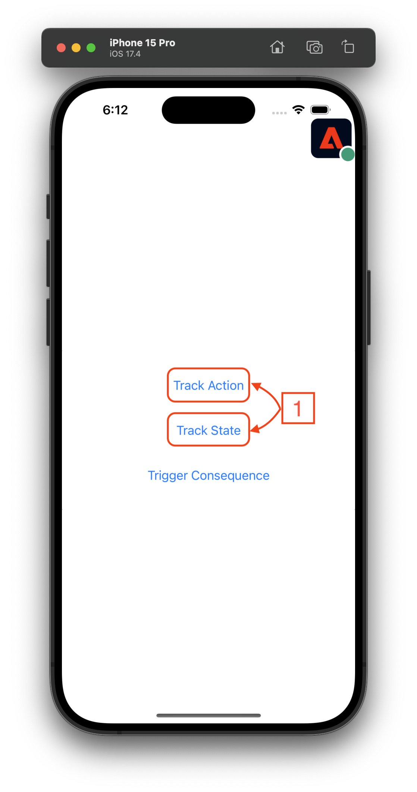
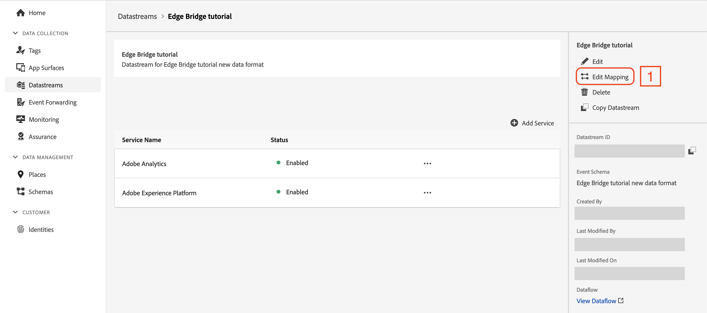
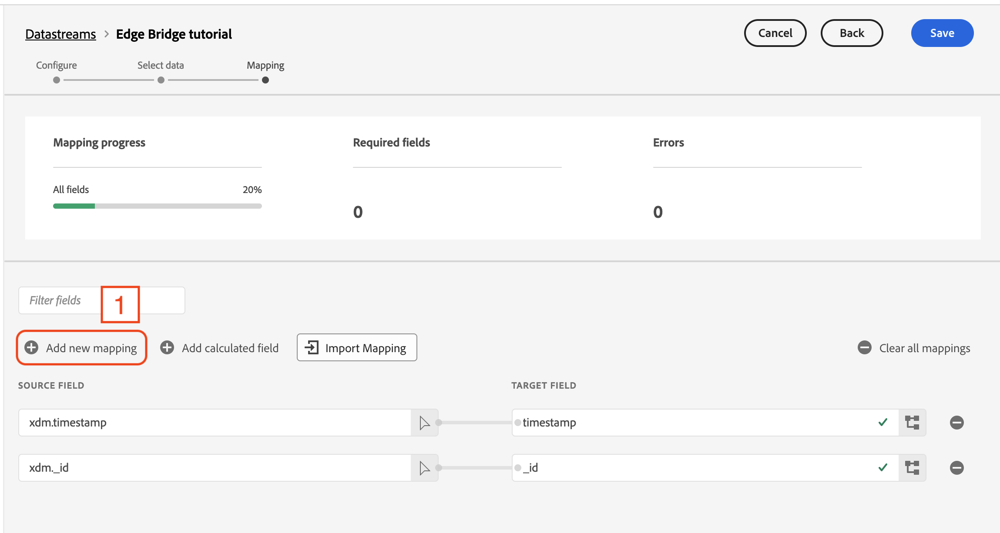
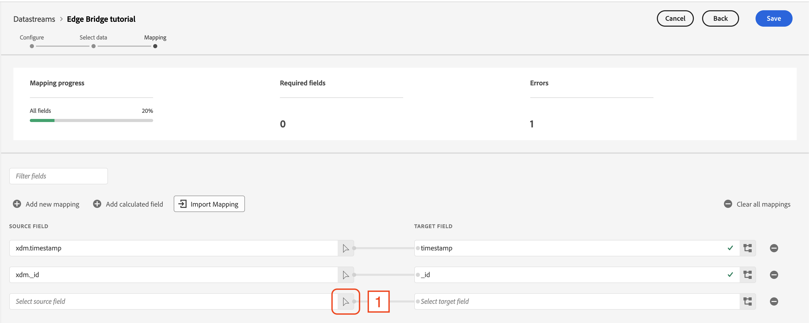
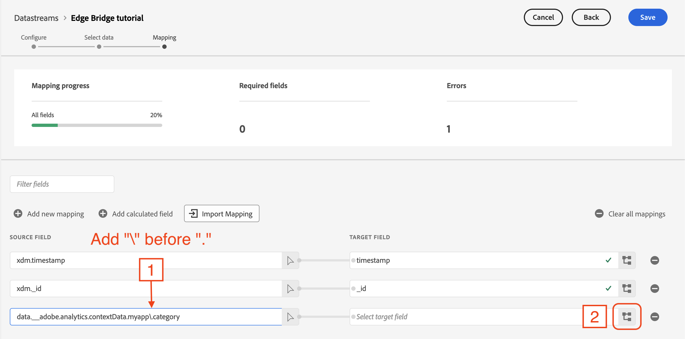
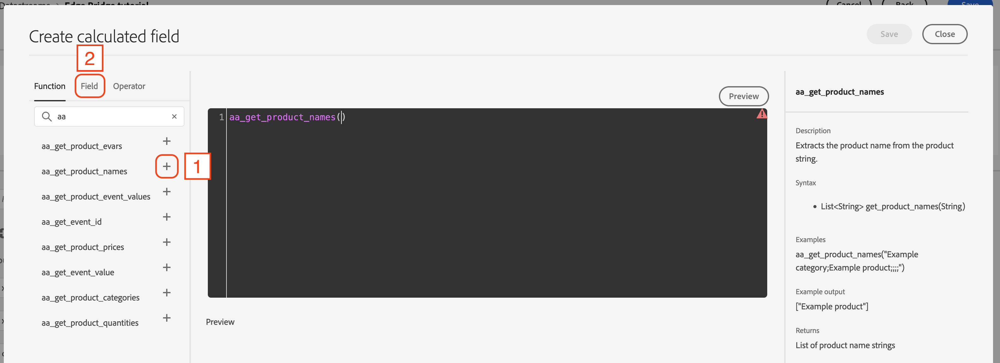
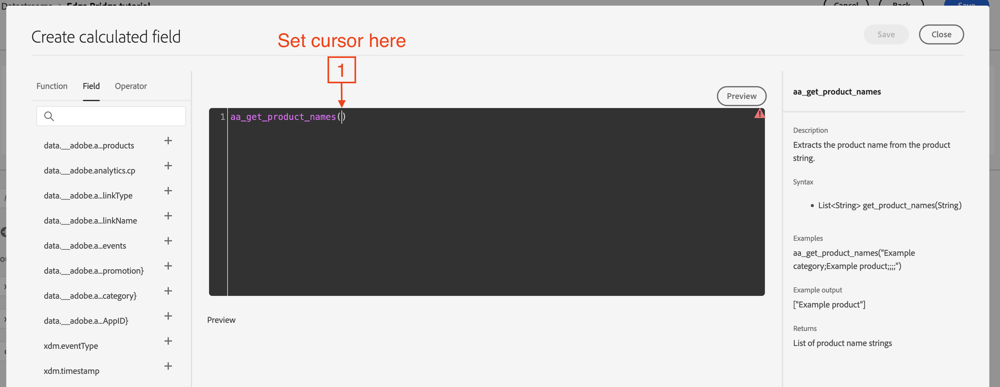
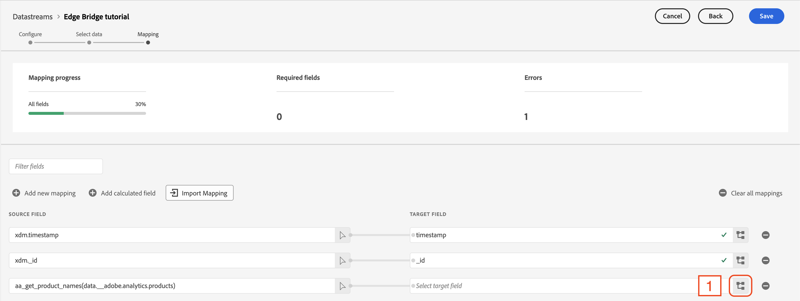
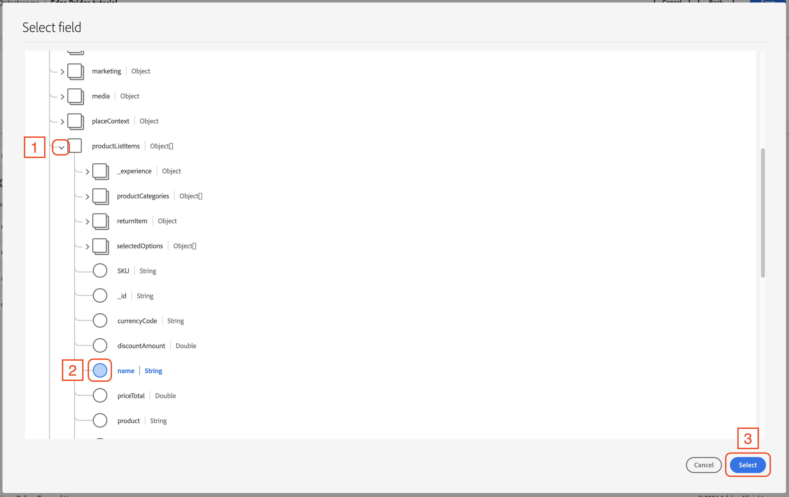
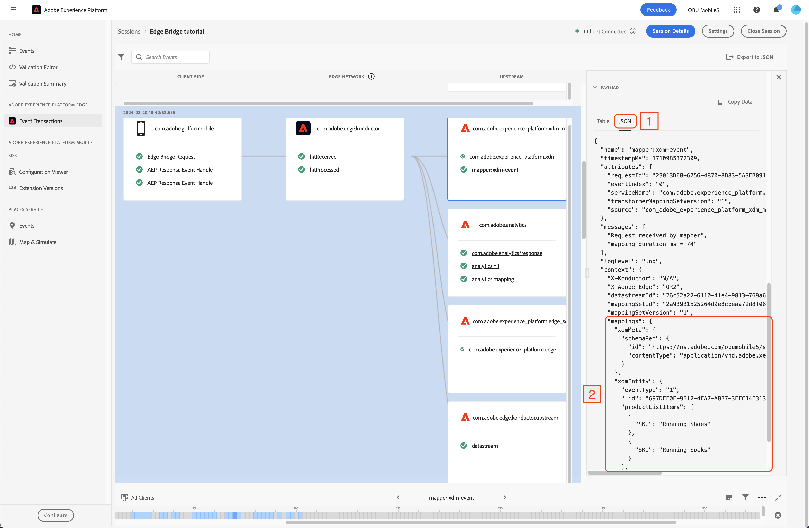

# Migrating from Analytics mobile extension to the Edge Network using the Edge Bridge extension <!-- omit in toc -->

## Table of Contents <!-- omit in toc -->
- [Overview](#overview)
  - [Environment](#environment)
  - [Prerequisites](#prerequisites)
- [Adobe Experience Platform setup](#adobe-experience-platform-setup)
  - [1. Set up mobile property](#1-set-up-mobile-property)
  - [2. Configure a rule to forward personally identifiable information (PII) events to Edge Network](#2-configure-a-rule-to-forward-personally-identifiable-information-pii-events-to-edge-network)
- [Client-side implementation](#client-side-implementation)
  - [1. Get a copy of the files (code and tutorial app)](#1-get-a-copy-of-the-files-code-and-tutorial-app)
  - [2. Install Edge Bridge using dependency manager (Swift Package Manager)](#2-install-edge-bridge-using-dependency-manager-swift-package-manager)
  - [3. Update tutorial app to enable Edge Bridge functionality](#3-update-tutorial-app-to-enable-edge-bridge-functionality)
  - [4. Run app](#4-run-app)
  - [5. `trackAction`/`trackState` implementation examples](#5-trackactiontrackstate-implementation-examples)
- [Validation with Assurance](#validation-with-assurance)
  - [1. Set up the Assurance session](#1-set-up-the-assurance-session)
  - [2. Connect the app to the Assurance session](#2-connect-the-app-to-the-assurance-session)
  - [3. Event transactions view - check for Edge Bridge events](#3-event-transactions-view---check-for-edge-bridge-events)
- [Optional - Data Prep for Data Collection mapping](#optional---data-prep-for-data-collection-mapping)
  - [Mapping custom `contextData` keys](#mapping-custom-contextdata-keys)
  - [Mapping calculated fields using Analytics functions](#mapping-calculated-fields-using-analytics-functions)
- [Validating Data Prep mapping using Assurance](#validating-data-prep-mapping-using-assurance)

## Overview
This tutorial covers how to use Edge Bridge as a drop-in solution for migrating from an existing Analytics implementation to sending data via the Edge Network to Analytics.


### Environment
- macOS machine with a recent version of Xcode installed.

### Prerequisites
> [!NOTE]
> The tutorial app for this exercise already includes the Edge extensions. To learn more about these extensions, please visit the [Edge tutorial](https://github.com/adobe/aepsdk-edge-ios/tree/main/Documentation/Tutorials).
1. A timestamp enabled report suite configured for mobile data collection.
2. A tag (also known as a mobile property) configured in the Data Collection UI, which has the Adobe Analytics extension installed and configured.

<details>
  <summary> <h3>Adobe Experience Platform setup - Skip this section if prerequisite item 2 has already been set up</h3> </summary>

## Adobe Experience Platform setup
This section demonstrates how to create and configure a mobile property in Experience Platform, which controls the configuration settings for the Mobile SDK extensions used in this tutorial.

### 1. Set up mobile property  
To create a new mobile property, refer to the [instructions on how to set up a new property](https://github.com/adobe/aepsdk-edge-ios/blob/main/Documentation/Tutorials/edge-send-event-tutorial.md#1-create-a-schema).

The following Experience Platform extension configurations should be installed:  

<details>
  <summary> Adobe Analytics </summary><p>

Open the **Catalog** and install the **Adobe Analytics** extension.

  

In the extension configuration settings window, set the report suite ID (**1**) for each environment to the one designated for this tutorial. Then, click **Save** (**2**).

  

</p></details>

<details>
  <summary> AEP Assurance </summary><p>

Open the **Catalog** and install the **AEP Assurance** extension.

  

</p></details>

<details>
  <summary> Adobe Experience Platform Edge Network </summary><p>

Open the **Catalog** and install the **Adobe Experience Platform Edge Network** extension.

  

In the extension configuration settings window, set the datastream for each environment (**1**) to the one designated for this tutorial. Then, click **Save** (**2**).

  

</p></details>

<details>
  <summary> Identity </summary><p>

Open the **Catalog** and install the **Identity** extension. There are no settings to configure for this extension.

  

</p></details>

<details>
  <summary> Consent </summary><p>

Open the **Catalog** and install the **Consent** extension.

  

In the extension configuration settings window, the **Default Consent Level** should be set to **Yes** by default (**1**). 

> [!IMPORTANT]
> For the tutorial app, this setting is acceptable as-is. However, when configuring this setting in production applications, it should align with the organization's data collection and privacy policies.

  

</p></details>

The following cards should be visible once all the extensions have been installed:

  

### 2. Configure a rule to forward personally identifiable information (PII) events to Edge Network
The [`collectPII`](https://developer.adobe.com/client-sdks/home/base/mobile-core/api-reference/#collectpii) API for Analytics does not send events to Edge Network by default; it requires a rule to be configured to forward these events. This section provides an example of how to create such a rule.

#### Create a rule <!-- omit in toc -->
1. In the Rules tab, select **Create New Rule**.
   - If your property already has rules, the button will be in the top right of the screen.
2. Give the rule a recognizable name (**1**) in your list of rules. 
   - In this example, the rule is named "Forward PII events to Edge Network".
4. In the **EVENTS** section, select **Add** (**2**).

  

#### Define the event <!-- omit in toc -->

1. From the **Extension** dropdown list (**1**), select **Mobile Core**.
2. From the **Event Type** dropdown list (**2**), select **Collect PII**.
3. Select **Keep Changes** (**3**).

  

#### Define the action <!-- omit in toc -->
1. Under the Actions section, select **+ Add** (**1**).

2. From the **Extension** dropdown list (**1**), select **Adobe Analytics**.
3. From the **Action Type** dropdown list (**2**), select **Track**.
4. Name the **Action** field (**3**) "collect_pii", in the right-side window.
5. Select the **+** (**4**) next to **Context Data** and set the **Key** to "ruleKey" and **Value** to "ruleValue" (**5**).
6. Select **Keep Changes** (**6**).

  

#### Save the rule and rebuild your property <!-- omit in toc -->
1. After completing your configuration, verify that your rule appears as follows:
2. Select **Save** (**1**).

  
</details>

## Client-side implementation
### 1. Get a copy of the files (code and tutorial app)
1. Open the code repository: https://github.com/adobe/aepsdk-edgebridge-ios
2. Select the green **Code** button in the top right.
3. In the window that opens, select **Download ZIP**; by default, it should download to your **Downloads** folder.
4. Unzip the archived file by opening it.
5. Navigate to the unarchived folder, then navigate to **Documentation** -> **Tutorials** -> **EdgeBridgeTutorialAppStart**.
6. Open the file **EdgeBridgeTutorialApp.xcworkspace**; this should automatically open the Xcode IDE.

### 2. Install Edge Bridge using dependency manager (Swift Package Manager)
The next task is to update the necessary dependencies to enable the Edge Bridge extension to function.

1. Install the Edge Bridge (`AEPEdgeBridge`) extension.
  - In Xcode, from the top bar, select **File** -> **Add Package Dependencies...**
  - In the **Search or Enter Package URL** search box in the top right, input `https://github.com/adobe/aepsdk-edgebridge-ios.git`
  - Select the **aepsdk-edgebridge-ios** package.
  - For **Dependency Rule**, select **Branch** and input `main`.
  - Select **Add Package**.

2. Remove the Analytics (`AEPAnalytics`) extension.
  - In Xcode, from the left side file navigator, select **EdgeBridgeTutorialApp**.
  - Under **PROJECT**, select **EdgeBridgeTutorialApp**.
  - Select **Package Dependencies**.
  - Select **AEPAnalytics** and then the minus (**-**) button under the table, then select **Remove**.

<details>
  <summary> Using CocoaPods instead? </summary><p>

**CocoaPods**
This tutorial assumes a project using Swift Package Manager (SPM) for package dependency management. However, if you are following along with a project that uses **CocoaPods**, refer to the [README for instructions on how to add the Edge Bridge extension](../../README.md#cocoapods).

</p></details>

### 3. Update tutorial app to enable Edge Bridge functionality
#### Add the Edge Bridge extension <!-- omit in toc -->
The file `AppDelegate.swift` needs to be updated to enable the **Edge Bridge** extension.
   
Inside, you will see code blocks for this tutorial that are greyed out because they are commented out. They are marked by the header and footer `Edge Bridge tutorial - code section n/m` (where `n` is the current comment section number and `m` is the total number of sections in the file).

To uncomment the section and activate the code, simply add a forward slash at the beginning of the header:
```swift
/* Edge Bridge tutorial - code section (1/2)
```
To:
```swift
//* Edge Bridge tutorial - code section (1/2)
```
Make sure that all sections within the file are uncommented (the total number of sections is indicated).

#### Update AppDelegate <!-- omit in toc -->
Open `AppDelegate.swift`:
1. In Xcode, in the left-side **Project Navigator** panel, select the dropdown chevron next to **EdgeBridgeTutorialApp**.
   - If the **Project Navigator** panel is not visible, from the top menu, select **View** -> **Navigators** -> **Show Project Navigator**.
2. Select the dropdown chevron next to the **EdgeBridgeTutorialApp** folder.
3. Select the `AppDelegate.swift` file.

**Set the tutorial app to use the mobile property ID:**
1. Update the `ENVIRONMENT_FILE_ID` value to the mobile property ID published in the first section.
   - See how to find your mobile property ID in the instructions for [getting the mobile property ID](https://github.com/adobe/aepsdk-edge-ios/blob/main/Documentation/Tutorials/edge-send-event-tutorial.md#getting-the-mobile-property-id-).

**Remove Analytics and AEPIdentity extensions:**  

> [!WARNING]
> Before proceeding, verify if your application uses any Adobe Experience Cloud Solution extensions, such as Adobe Target or Adobe Campaign (find the full list [here](https://developer.adobe.com/client-sdks/solution/)). Only remove `AEPIdentity` if no other solution extensions are in use.

Inside `AppDelegate.swift`, you will see code blocks for this tutorial marked by a header and footer `Edge Bridge tutorial - remove section (n/m)` (where `n` is the current comment section number and `m` is the total number of sections in the file).

Delete everything between the header and footer, and do this for all "remove section" blocks within the file.

For details on the various Edge extensions used, see the [table of related projects](../../README.md#related-projects).

### 4. Run app
In Xcode, select the app target you want to run, and the destination device to run it on (either a simulator or a physical device). Then press the **Play** button in the top left.

You should see your application running on the selected device, with logs displayed in the Xcode console.

> [!TIP]
> If the debug console area is not shown by default, activate it by selecting:  
> **View** -> **Debug Area** -> **Activate Console**

### 5. `trackAction`/`trackState` implementation examples
With the Edge Bridge extension successfully installed and registered, you can continue to make existing Analytics `trackAction` and `trackState` calls. These will be captured by the Edge Bridge extension and sent to the Edge Network.

Check `ContentView.swift` for implementation examples of both APIs. You will see the data payloads that are sent with each call.

## Validation with Assurance
Assurance is the Experience Platform tool for inspecting all events that Adobe extensions send out in real time. It allows observing the flow of events, including the Edge Bridge conversion of `trackAction`/`trackState` events.

### 1. Set up the Assurance session
To create a new Assurance session and connect to it, see the instructions on [setting up an Assurance session](https://github.com/adobe/aepsdk-edge-ios/blob/main/Documentation/Tutorials/edge-send-event-tutorial.md#1-set-up-the-assurance-session), using the base URL value:
```
edgebridgetutorialapp://
```

### 2. Connect the app to the Assurance session  
To connect the tutorial app to the Assurance session, see the instructions on [connecting the app to the Assurance session](https://github.com/adobe/aepsdk-edge-ios/blob/main/Documentation/Tutorials/edge-send-event-tutorial.md#2-connect-to-the-app).

### 3. Event transactions view - check for Edge Bridge events  
#### `trackAction`/`trackState` events <!-- omit in toc -->
To view Edge Bridge events in the connected app instance:
1. Trigger a `trackAction` or `trackState` within the app, which the Edge Bridge extension will convert into Edge events. These events will be captured by the Assurance extension and displayed in the web session viewer.



1. Select the **AnalyticsTrack** event (**1**) in the events table to view the event details in the right side window.
2. Select the **RAW EVENT** dropdown (**2**) in the event details window to view the event data payload.
3. Verify that the `contextdata` matches what was sent by the Analytics `trackAction`/`trackState` API.


1. Now select the **Edge Bridge Request** event (**1**) in the events table.
2. Select the **RAW EVENT** dropdown (**2**) in the event details window; observe the transformation of the payload structure with the help of the Edge Bridge extension. The **Edge Bridge Request** event conforms to the format of an Edge Network event.


The following table and diagram highlight the differences in event data structure and format between the two types of events: Analytics (left) vs Edge (right) when using the Edge Bridge extension:

| Item | Before (Analytics) | After (Edge Bridge) |
| --- | --- | --- |
| 1 | Top level `ACPExtensionEventType`: `generic.track` | Top level `ACPExtensionEventType`: `edge`<br>`ACPExtensionEventData.xdm.eventType`: `analytics.track` |
| 2 | `contextdata` key under `ACPExtensionEventData` | `contextData` transformed and moved under `data.__adobe.analytics` |
| 3 | Keys with reserved prefix `&&` directly under `contextdata` | Keys with prefix `&&` transformed and moved under `data.__adobe.analytics` |
| 4 | No Analytics metrics | Analytics metrics added under `data.__adobe.analytics` (varying locations) |


> [!NOTE]
> The two new top-level properties `xdm` and `data` are standard Edge Network event properties, integral to Experience Platform's [Experience Data Model (XDM)](https://experienceleague.adobe.com/en/docs/experience-platform/xdm/home) schema-based system for event data organization. This system allows for powerful, customizable data processing.

To learn more about the final data format created by Edge Bridge, please refer to the [data format documentation](../data-format.md).

#### Trigger rule-based `trackAction` events <!-- omit in toc -->
Rule-based `trackAction`/`trackState` events are also converted to Edge events by the Edge Bridge extension. Select the **Trigger Consequence** button (**1**) to initiate a rule that generates a `trackAction` event.


> [!TIP]
> If no `trackAction` event is dispatched upon selecting the **Trigger Consequence** button, verify that your mobile property is [set up with the correct rule](#2-configure-a-rule-to-forward-personal-identifiable-information-pii-events-to-edge-network).

Just like the `trackAction`/`trackState` events above, the Edge Bridge extension converts the personal PII `trackAction` event into an Edge event.

With this, the migration from an existing Analytics implementation to sending data via Edge Network to Analytics, powered by Edge Bridge, is complete!

## Optional - Data Prep for Data Collection mapping
Edge Bridge transforms track events into an Edge Network event format suitable for Adobe Analytics, so that mapping data to [Experience Data Model (XDM)](https://experienceleague.adobe.com/docs/experience-platform/xdm/home.html) is not required for Analytics when migrating. However, to use this same event data in other Experience Platform applications, it must first be mapped to the XDM specification using [Data Prep for Data Collection](https://experienceleague.adobe.com/en/docs/experience-platform/datastreams/data-prep).

This section covers how to map event data sent from Edge Bridge in the Data Collection UI.

To open the Data Prep mapper:
1. Log in to the [Adobe Experience Platfom](https://experience.adobe.com/#/platform).
2. In the left-side navigation panel under **DATA COLLECTION**, select **Datastreams** (**1**).
3. Select your datastream (**2**).

  

4. In the right-side navigation panel, select **Edit Mapping** (**1**).  



> [!IMPORTANT]
> Data Prep allows only one consolidated mapping configuration per datastream, meaning all potential event payloads sent through a specific datastream must be merged for simultaneous mapping. Note that Data Prep requires `data` and `xdm` to be top-level objects in the source JSON.

We will cover two mapping use cases:
1. Custom `contextData` keys.
2. Using Data Prep Analytics functions to map Analytics-formatted strings, such as `products` and `events`.

The properties from `trackAction` and `trackState` events in the tutorial app must be combined into a single JSON. For simplicity, the merged data structure is provided below:

```json
{
  "data": {
    "__adobe": {
      "analytics": {
        "products": ";Running Shoes;1;69.95;event1|event2=55.99;eVar1=12345,;Running Socks;10;29.99;event2=10.95;eVar1=54321",
        "cp": "foreground",
        "linkType": "other",
        "linkName": "purchase",
        "events": "event5,purchase",
        "contextData": {
          "myapp.promotion": "a0138",
          "myapp.category": "189025",
          "a.AppID": "EdgeBridgeTutorialApp 1.0 (1)"
        }
      }
    }
  },
  "xdm": {
    "eventType": "analytics.track",
    "timestamp": "2024-03-21T00:56:44.052Z"
  }
}
```

<details>
  <summary> Getting the JSON data from Assurance </summary><p>
  
1. Navigate back to your Assurance session for the Edge Bridge app and select the **Edge Bridge Request** event (**1**).
2. Open the **RAW EVENT** dropdown, then click and drag to highlight the **ACPExtensionEventData** value as shown, and copy the selected value.

  

> [!TIP]
> To merge event data, look for properties under the `data.__adobe.analytics` hierarchy that are unique among the different types of events sent from your app, and include them in the final data payload.

</p></details>

1. Copy and paste the JSON data into the input box under **Define Incoming Data** (**1**).
2. Check that the uploaded JSON matches what is displayed in the `Preview Sample Data` section (**2**) and select `Next` (**3**).

  

> [!NOTE]
> XDM source fields automatically map to the target schema when the same field exists in both. For example, `xdm._id` and `xdm.timestamp` are required fields in a time-series XDM schema, thus they automatically map from source data to the target schema without needing a manual mapping entry.

> [!TIP]
> Edge Bridge automatically assigns an `xdm.eventType` value of `analytics.track`. However, you can override this value by adding a new mapping row in Data Prep and setting the **Target Field** to `eventType`.

### Mapping custom `contextData` keys

1. Select the **Add new mapping** button (**1**).

  

2. A new entry for mapping will appear in the window; select the arrow button (**1**) to the right of the **Select source field** input box.

  

3. In the JSON property selector window, select the dropdown chevrons next to **data** -> **__adobe** -> **analytics** -> **contextData** (**1**).
4. Then choose the property to map, **myapp.category** (**2**), and select **Select** (**3**).

  

> [!IMPORTANT]
> When interacting with hierarchies, if a child attribute contains a period (`.`), use a backslash (`\`) to escape special characters. For more details, refer to the guide on [escaping special characters](https://experienceleague.adobe.com/en/docs/experience-platform/data-prep/home#escape-special-characters).

5. Add a backslash `\` before the `.` character in `myapp.category` as shown below (**1**).
    - Example: `myapp.category` -> `myapp\.category`

Now that the source field setup is complete, the next step is to map this property to its corresponding target property in the XDM schema.

6. Select the schema icon (**2**) to open the XDM property viewer window.

  

7. In the XDM property viewer window, select the dropdown chevron next to **application** (**1**).
8. Then choose the **closeType** property (**2**) and select **Select** (**3**).

  

The final result is a mapping from the custom `contextData` key `myapp.context` to `application.closeType`

  

After creating the desired mappings, select **Save** in the top right.

### Mapping calculated fields using Analytics functions

1. Select the **Add calculated field** button (**1**).

  

1. In the **Create Calculated Field** window, check that the **Function** tab (**1**) is selected, then narrow down to the Analytics functions by inputting `aa` into the search box (**2**).

  

1. Select the plus button next to **aa_get_product_names** (**1**) and notice that the function is populated in the main editor window.
2. Next, select the **Field** tab (**2**).

> [!TIP]
> Selecting the function name itself will display help text in the right-side help panel, which will give you more context on how to use the function.

  

1. Set the editor cursor between the parentheses of the `aa_get_product_names()` function in the editor area (**1**).

  

1. Select the plus button (**+**) next to **data.__adobe.analytics.products** (**1**) - it may appear truncated like: `data.__adobe.a...products`
   1. Notice the green checkmark (**2**) in the top right of the editor area indicating correct syntax.
   2. Select **Preview** (**3**) to see what the output of the function will be, based on what is currently in the editor and the original source JSON.

  

7. Select the schema icon (**1**) to open the XDM property viewer window.

  

7. In the XDM property viewer window, select the dropdown chevron next to **productListItems** (**1**).
8. Then choose the **name** property (**2**) and select **Select** (**3**).

  

> [!TIP] 
> If you want to map an array of objects in the source field to an array of different objects in the target field, add `[*]` after the array name in the destination field paths.

  

After creating the desired mappings, select **Save** in the top right.

See the documentation on the [Analytics functions](https://experienceleague.adobe.com/en/docs/experience-platform/data-prep/functions#analytics) for the full list of Data Prep Analytics functions.

## Validating Data Prep mapping using Assurance
Now that the mapping is set up in the datastream, we have the full pathway of data:


By using the **Event Transactions** view (**1**) in the left-side navigation panel, you can follow the logical flow of events from the event dispatched by the `trackAction` API to data mapping.  
1. Select the Data Prep mapping event **mapper:xdm-event** (**2**) to see the event details in the right-side information panel.
2. Under the **PAYLOAD** section (**3**), you can explore the event payload data.

  

To see the data in JSON format, select the **JSON** tab (**1**). You can view the event data in JSON format below (**2**).
  

