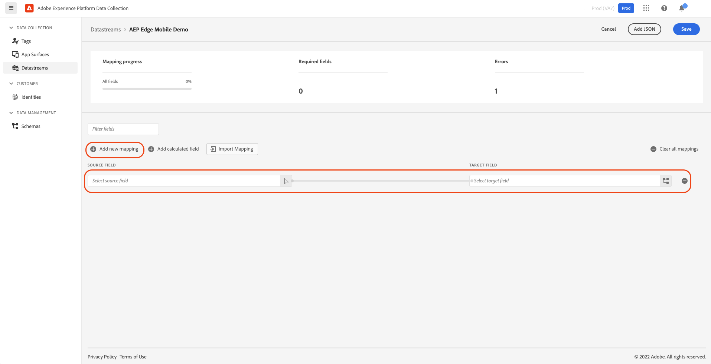
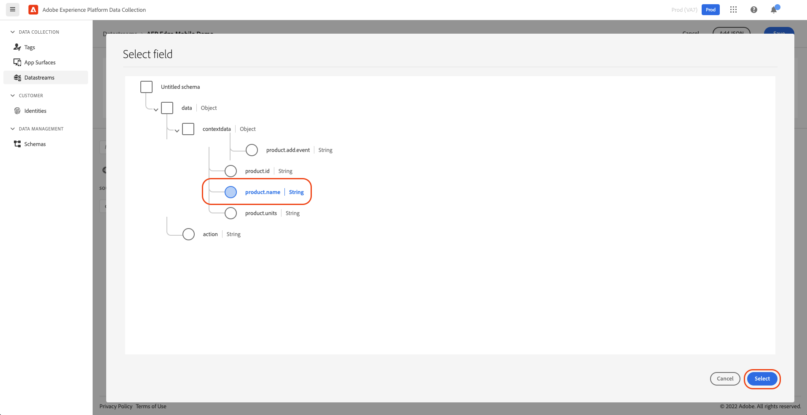
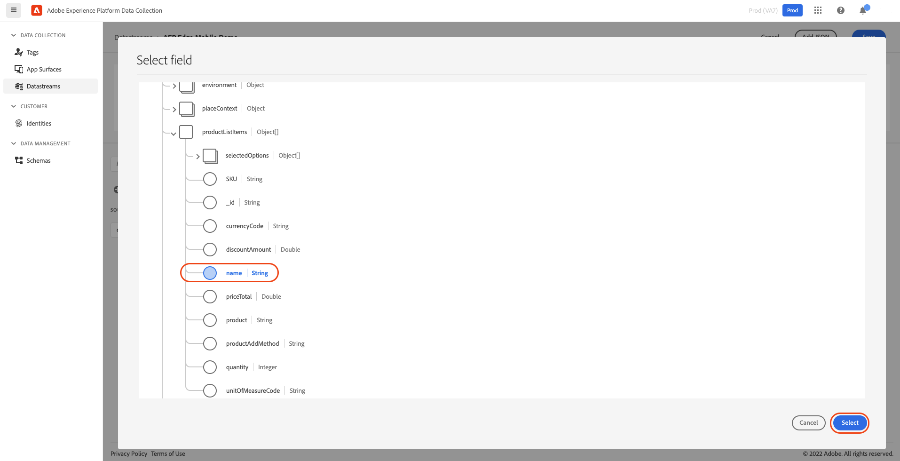
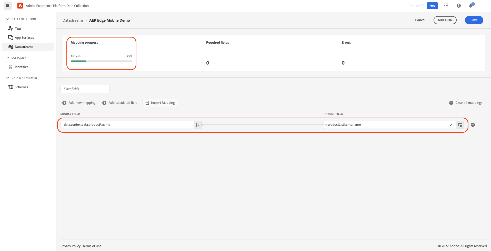
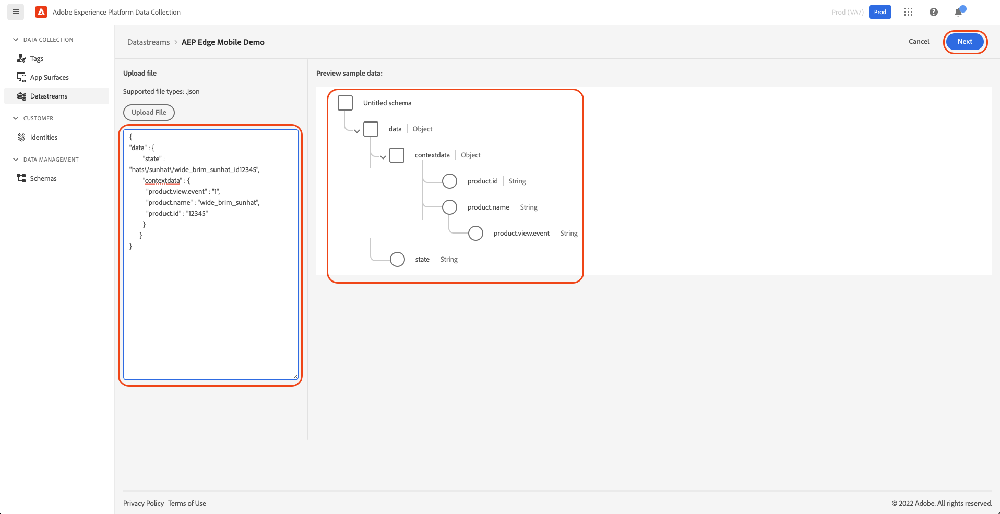
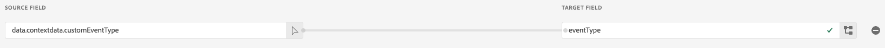

# Map trackState and trackAction data using Data Prep for Data Collection
Data Prep is an Adobe Experience Platform service which maps and transforms data to the [Experience Data Model (XDM)](https://experienceleague.adobe.com/docs/experience-platform/xdm/home.html).  Data Prep is configured from a Platform enabled [datastream](https://experienceleague.adobe.com/docs/experience-platform/edge/datastreams/overview.html) to map source data from the Edge Bridge mobile extension to the Platform Edge Network.

This guide covers how to map data sent from the Edge Bridge within the Data Collection UI.

For a quick overview of the capabilities of Data Prep, watch the following [video](https://experienceleague.adobe.com/docs/platform-learn/data-collection/edge-network/data-prep.html).

> **Note**
> The following documentation provides a comprehensive overview of the Data Prep capabilities:
> - [Data Prep overview](https://experienceleague.adobe.com/docs/experience-platform/data-prep/home.html)
> - [Data Prep mapping functions](https://experienceleague.adobe.com/docs/experience-platform/data-prep/functions.html)
> - [Handling data formats with Data Prep](https://experienceleague.adobe.com/docs/experience-platform/data-prep/data-handling.html)
>

## Prerequisites
Before continuing, create an XDM schema and configure a datastream using the following tutorials. In order to send data to the Edge Network, the datastream must be configured with the Adobe Experience Platform service.
- [Create a schema](https://experienceleague.adobe.com/docs/platform-learn/implement-mobile-sdk/initial-configuration/create-schema.html)
- [Createa  datastream](https://experienceleague.adobe.com/docs/platform-learn/implement-mobile-sdk/initial-configuration/create-datastream.html)

In the following steps, the examples assume the schema configured with the datastream contain these field groups:
- AEP Mobile Lifecycle Details
- Adobe Experience Edge Autofilled Environment Details
- Commerce Details

## Select data
While creating a new datastream, select **Save and Add Mapping** to go to the **Select data** step directly.  Alternately, if using an already saved datastream, select **Edit Mapping**. From here, provide a sample JSON object that represents the data layer used in the application as sent from the Edge Bridge mobile extension.

The following are examples of the JSON objects sent from the Edge Bridge mobile extension. The Experience event sent from the Edge Bridge extension contains both **xdm** and **data** JSON objects. The **data** object contains the context data passed to the _MobileCore.trackAction()_ and _MobileCore.trackState()_ APIs.

The following is an example of an _MobileCore.trackAction_ API call and the resulting JSON Experience event sent to the Edge Network. Note the JSON is truncated to show just the relevant data.
```swift
MobileCore.track(action: "add_to_cart", data: ["product.id": "12345", "product.add.event": "1", "product.name": "wide_brim_sunhat", "product.units": "1"])
```

<details>
  <summary> Track action Experience event JSON</summary><p>

```json
{
  "meta" : {
    ...
    },
    "state" : {
      ...
    }
  },
  "xdm" : {
    "identityMap" : {
      ...
    },
    "implementationDetails" : {
      ...
    }
  },
  "events" : [
    {
      "xdm" : {
        "_id" : "BB5F44B4-6860-4AAB-A277-0387822F0D07",
        "eventType" : "analytics.track",
        "timestamp" : "2022-06-08T00:25:21.135Z"
      },
      "data" : {
        "contextdata" : {
          "product.id" : "12345",
          "product.add.event" : "1",
          "product.name" : "wide_brim_sunhat",
          "product.units" : "1"
        },
        "action" : "add_to_cart"
      }
    }
  ]
}
```

</p></details>


The following is an example of a _MobileCore.trackState_ API call and the resulting JSON Experience event sent to the Edge Network. Note the JSON is truncated to show just the relevant data.
```swift
MobileCore.track(state: "hats/sunhat/wide_brim_sunhat_id12345", data: ["product.name": "wide_brim_sunhat", "product.id": "12345", "product.view.event": "1"])
```

<details>
  <summary>Track state Experience event JSON</summary><p>

```json
{
  "meta" : {
    ...
    },
    "state" : {
      ...
    }
  },
  "xdm" : {
    "identityMap" : {
      ...
    },
    "implementationDetails" : {
      ...
    }
  },
  "events" : [
    {
      "xdm" : {
        "_id" : "407AE222-B764-493F-923C-294AF54C6500",
        "eventType" : "analytics.track",
        "timestamp" : "2022-06-08T00:25:22.531Z"
      },
      "data" : {
        "state" : "hats\/sunhat\/wide_brim_sunhat_id12345",
        "contextdata" : {
          "product.view.event" : "1",
          "product.name" : "wide_brim_sunhat",
          "product.id" : "12345"
        }
      }
    }
  ]
}
```

</p></details>

To capture properties from Experience events, extract the JSON object under the **events** array object, as Data Prep requires that the **data** and **xdm** objects are top-level objects in the provided JSON source. If the JSON is valid, a preview schema is displayed in the right-hand panel. Select **Next** to continue.


## Mapping
From the **Mapping** step, fields from the source data are mapped to the target fields of the XDM schema in Experience Platform.

Select **Add new mapping** to create a new mapping row.



Select the source icon (), and select the source field from the dialog that appears. Use the **Select** button to continue.



Now select the schema icon (), and select the target schema field from the dialog that appears. Use the **Select** button to continue.



The mapping page now displays the source to target field mapping. The **Mapping progress** section displays the progress of the total number of source fields mapped.
> **Warning**
> Source fields which contain periods need the periods escaped, otherwise the mapping service will interpret the field as nested objects. The source field may be manually edited to escape the periods, as in `data.contextdata.product\.name`.



Continue the above steps to map additional fields to the target schema. It is not required to map all the source fields to the target schema, however any required source fields must be mapped. The **Required fields** counter displays the number of required source fields which are yet to be mapped. Once all the required source fields are mapped, select **Save** to complete the mapping.


The mapping process may be repeated for additional source data if needed by selecting the **Add JSON** button.



> **Note**
> XDM source fields are automatically mapped if the same field appears in the target schema. For example, the fields _xdm.\_id_ and _xdm.timestamp_ are required fields in a time-series XDM schema so you will notice they are automatically mapped from the source data to the target schema and do not require a mapping entry.

> **Note**
> The Edge Bridge extension automatically sets an _xdm.eventType_ value of _analytics.track_. However, the value may be changed by adding a new mapping row in Data Prep by setting the **Target Field** to "eventType".
> 
